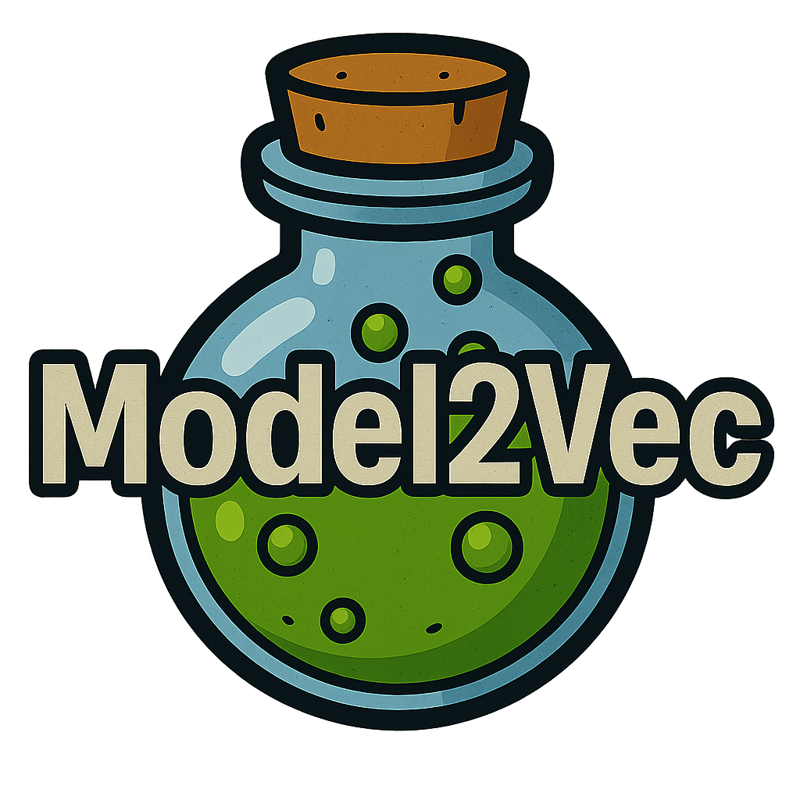

<h2 align="center">
  <br/>
  Fast State-of-the-Art Static Embeddings
</h2>


<div align="center">
  <h2>
    <a href="https://huggingface.co/minishlab"><strong>🤗 Models</strong></a> |
    <a href="https://github.com/MinishLab/model2vec/tree/main/tutorials"><strong>📚 Tutorials</strong></a> |
    <a href="https://minishlab.github.io/"><strong>🌐 Blog</strong></a> |
    <a href="https://github.com/MinishLab/model2vec/blob/main/results/README.md"><strong>🏆 Results</strong></a> |
    <a href="https://github.com/MinishLab/model2vec/blob/main/docs"><strong>📖 Docs</strong></a>
  </h2>
</div>

<div align="center">
  <h2>
    <a href="https://pypi.org/project/model2vec/"></a>
    <a href="https://pypi.org/project/model2vec/"></a>
    <a href="https://pepy.tech/project/model2vec">
      
    </a>
    <a href="https://app.codecov.io/gh/MinishLab/model2vec">
      
    </a>
    <a href="https://discord.gg/4BDPR5nmtK">
      
    </a>
    <a href="https://github.com/MinishLab/model2vec/blob/main/LICENSE">
      
    </a>
  </h2>
</div>


Model2Vec is a technique to turn any sentence transformer into a really small static model, reducing model size by a factor up to 50 and making the models up to 500 times faster, with a small drop in performance. Our [best model](https://huggingface.co/minishlab/potion-base-8M) is the most performant static embedding model in the world. See our results [here](results/README.md), or dive in to see how it works.

<div align="center">
<h3>

[Quickstart](#quickstart) • [Updates & Announcements](#updates--announcements) • [Main Features](#main-features) • [Model List](#model-list)
</h3>
</div>

## Quickstart

Install the lightweight base package with:

```bash
pip install model2vec
```

You can start using Model2Vec by loading one of our [flagship models from the HuggingFace hub](https://huggingface.co/collections/minishlab/potion-6721e0abd4ea41881417f062). These models are pre-trained and ready to use. The following code snippet shows how to load a model and make embeddings, which you can use for any task, such as  text classification, retrieval, clustering, or building a RAG system:
```python
from model2vec import StaticModel

# Load a model from the HuggingFace hub (in this case the potion-base-8M model)
model = StaticModel.from_pretrained("minishlab/potion-base-8M")

# Make embeddings
embeddings = model.encode(["It's dangerous to go alone!", "It's a secret to everybody."])

# Make sequences of token embeddings
token_embeddings = model.encode_as_sequence(["It's dangerous to go alone!", "It's a secret to everybody."])
```

Instead of using one of our models, you can also distill your own Model2Vec model from a Sentence Transformer model. First, install the `distillation` extras with:

```bash
pip install model2vec[distill]
```


 Then, you can distill a model in ~30 seconds on a CPU with the following code snippet:

```python
from model2vec.distill import distill

# Distill a Sentence Transformer model, in this case the BAAI/bge-base-en-v1.5 model
m2v_model = distill(model_name="BAAI/bge-base-en-v1.5", pca_dims=256)

# Save the model
m2v_model.save_pretrained("m2v_model")
```

After distillation, you can also fine-tune your own classification models on top of the distilled model, or on a pre-trained model. First, make sure you install the `training` extras with:

```bash
pip install model2vec[training]
```

Then, you can fine-tune a model as follows:

```python
import numpy as np
from datasets import load_dataset
from model2vec.train import StaticModelForClassification

# Initialize a classifier from a pre-trained model
classifier = StaticModelForClassification.from_pretrained(model_name="minishlab/potion-base-32M")

# Load a dataset. Note: both single and multi-label classification datasets are supported
ds = load_dataset("setfit/subj")

# Train the classifier on text (X) and labels (y)
classifier.fit(ds["train"]["text"], ds["train"]["label"])

# Evaluate the classifier
classification_report = classifier.evaluate(ds["test"]["text"], ds["test"]["label"])
```

For advanced usage, please refer to our [usage documentation](https://github.com/MinishLab/model2vec/blob/main/docs/usage.md).

## Updates & Announcements

- **23/05/2025**: We released [potion-multilingual-128M](https://huggingface.co/minishlab/potion-multilingual-128M), a multilingual model trained on 101 languages. It is the best performing static embedding model for multilingual tasks, and is capable of generating embeddings for any text in any language. The results can be found in our [results](results/README.md#mmteb-results-multilingual) section.

- **01/05/2025**: We released backend support for `BPE` and `Unigram` tokenizers, along with quantization and dimensionality reduction. New Model2Vec models are now 50% of the original models, and can be quantized to int8 to be 25% of the size, without loss of performance.

- **12/02/2025**: We released **Model2Vec training**, allowing you to fine-tune your own classification models on top of Model2Vec models. Find out more in our [training documentation](https://github.com/MinishLab/model2vec/blob/main/model2vec/train/README.md) and [results](results/README.md#training-results).

- **30/01/2025**: We released two new models: [potion-base-32M](https://huggingface.co/minishlab/potion-base-32M) and [potion-retrieval-32M](https://huggingface.co/minishlab/potion-retrieval-32M). [potion-base-32M](https://huggingface.co/minishlab/potion-base-32M) is our most performant model to date, using a larger vocabulary and higher dimensions. [potion-retrieval-32M](https://huggingface.co/minishlab/potion-retrieval-32M) is a finetune of [potion-base-32M](https://huggingface.co/minishlab/potion-base-32M) that is optimized for retrieval tasks, and is the best performing static retrieval model currently available.

- **30/10/2024**: We released three new models: [potion-base-8M](https://huggingface.co/minishlab/potion-base-8M), [potion-base-4M](https://huggingface.co/minishlab/potion-base-4M), and [potion-base-2M](https://huggingface.co/minishlab/potion-base-2M). These models are trained using [Tokenlearn](https://github.com/MinishLab/tokenlearn). Find out more in our [blog post](https://minishlab.github.io/tokenlearn_blogpost/). NOTE: for users of any of our old English M2V models, we recommend switching to these new models as they [perform better on all tasks](https://github.com/MinishLab/model2vec/tree/main/results).

## Main Features

- **State-of-the-Art Performance**: Model2Vec models outperform any other static embeddings (such as GLoVe and BPEmb) by a large margin, as can be seen in our [results](results/README.md).
- **Small**: Model2Vec reduces the size of a Sentence Transformer model by a factor of up to 50. Our [best model](https://huggingface.co/minishlab/potion-base-8M) is just ~30 MB on disk, and our smallest model just ~8 MB (making it the smallest model on [MTEB](https://huggingface.co/spaces/mteb/leaderboard)!).
- **Lightweight Dependencies**: the base package's only major dependency is `numpy`.
- **Lightning-fast Inference**: up to 500 times faster on CPU than the original model.
- **Fast, Dataset-free Distillation**: distill your own model in 30 seconds on a CPU, without a dataset.
- **Fine-tuning**: fine-tune your own classification models on top of Model2Vec models.
- **Integrated in many popular libraries**: Model2Vec is integrated direclty into popular libraries such as [Sentence Transformers](https://github.com/UKPLab/sentence-transformers) and [LangChain](https://github.com/langchain-ai/langchain). For more information, see our [integrations documentation](https://github.com/MinishLab/model2vec/blob/main/docs/integrations.md).
- **Tightly integrated with HuggingFace hub**: easily share and load models from the HuggingFace hub, using the familiar `from_pretrained` and `push_to_hub`. Our own models can be found [here](https://huggingface.co/minishlab).

## What is Model2Vec?

Model2vec creates a small, fast, and powerful model that outperforms other static embedding models by a large margin on all tasks we could find, while being much faster to create than traditional static embedding models such as GloVe. Like BPEmb, it can create subword embeddings, but with much better performance. Distillation doesn't need _any_ data, just a vocabulary and a model.

The core idea is to forward pass a vocabulary through a sentence transformer model, creating static embeddings for the indiviudal tokens. After this, there are a number of post-processing steps we do that results in our best models. For a more extensive deepdive, please refer to the following resources:
- Our initial [Model2Vec blog post](https://huggingface.co/blog/Pringled/model2vec). Note that, while this post gives a good overview of the core idea, we've made a number of substantial improvements since then.
- Our [Tokenlearn blog post](https://minishlab.github.io/tokenlearn_blogpost/). This post describes the Tokenlearn method we used to train our [potion models](https://huggingface.co/collections/minishlab/potion-6721e0abd4ea41881417f062).
- Our official [documentation](https://github.com/MinishLab/model2vec/blob/main/docs/what_is_model2vec.md). This document provides a high-level overview of how Model2Vec works.

## Documentation

Our official documentation can be found [here](https://github.com/MinishLab/model2vec/blob/main/docs/README.md). This includes:
- [Usage documentation](https://github.com/MinishLab/model2vec/blob/main/docs/usage.md): provides a technical overview of how to use Model2Vec.
- [Integrations documentation](https://github.com/MinishLab/model2vec/blob/main/docs/integrations.md): provides examples of how to use Model2Vec in various downstream libraries.
- [Model2Vec technical documentation](https://github.com/MinishLab/model2vec/blob/main/docs/what_is_model2vec.md): provides a high-level overview of how Model2Vec works.


## Model List

We provide a number of models that can be used out of the box. These models are available on the [HuggingFace hub](https://huggingface.co/collections/minishlab/model2vec-base-models-66fd9dd9b7c3b3c0f25ca90e) and can be loaded using the `from_pretrained` method. The models are listed below.


| Model                                                                 | Language    | Sentence Transformer                                            | Params  | Task      |
|-----------------------------------------------------------------------|------------|-----------------------------------------------------------------|---------|-----------|
| [potion-base-32M](https://huggingface.co/minishlab/potion-base-32M)   | English    | [bge-base-en-v1.5](https://huggingface.co/BAAI/bge-base-en-v1.5) | 32.3M   | General   |
| [potion-multilingual-128M](https://huggingface.co/minishlab/potion-multilingual-128M) | Multilingual | [bge-m3](https://huggingface.co/BAAI/bge-m3)      | 128M    | General   |
| [potion-retrieval-32M](https://huggingface.co/minishlab/potion-retrieval-32M) | English    | [bge-base-en-v1.5](https://huggingface.co/BAAI/bge-base-en-v1.5) | 32.3M   | Retrieval |
| [potion-base-8M](https://huggingface.co/minishlab/potion-base-8M)     | English    | [bge-base-en-v1.5](https://huggingface.co/BAAI/bge-base-en-v1.5) | 7.5M    | General   |
| [potion-base-4M](https://huggingface.co/minishlab/potion-base-4M)     | English    | [bge-base-en-v1.5](https://huggingface.co/BAAI/bge-base-en-v1.5) | 3.7M    | General   |
| [potion-base-2M](https://huggingface.co/minishlab/potion-base-2M)     | English    | [bge-base-en-v1.5](https://huggingface.co/BAAI/bge-base-en-v1.5) | 1.8M    | General   |


## Results

We have performed extensive experiments to evaluate the performance of Model2Vec models. The results are documented in the [results](results/README.md) folder. The results are presented in the following sections:
- [MTEB Results](results/README.md#mteb-results)
- [Training Results](results/README.md#training-results)
- [Ablations](results/README.md#ablations)

## License

MIT

## Citing

If you use Model2Vec in your research, please cite the following:
```bibtex
@article{minishlab2024model2vec,
  author = {Tulkens, Stephan and {van Dongen}, Thomas},
  title = {Model2Vec: Fast State-of-the-Art Static Embeddings},
  year = {2024},
  url = {https://github.com/MinishLab/model2vec}
}
```
