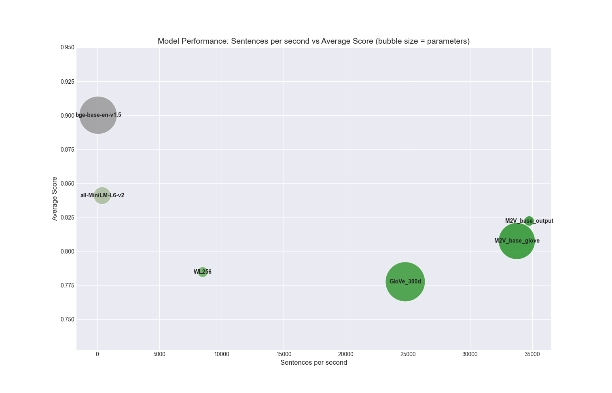

# Model2Vec: Turn any Sentence Transformer into a Small Fast Model

**Model2Vec** is a method to turn any Sentence Transformer model into a small, fast model.

## Table of Contents
- [Main Features](#main-features)
- [Installation](#installation)
- [What is Model2Vec?](#what-is-model2vec)
- [Who is this for?](#who-is-this-for)
- [Quickstart](#quickstart)
- [Useage](#useage)
    - [Distilling a Model2Vec model](#distilling-a-model2vec-model)
    - [Inferencing a Model2Vec model](#inferencing-a-model2vec-model)
    - [Evaluating a Model2Vec model](#evaluating-a-model2vec-model)
- [Results](#results)
- [Citing](#citing)

## Main Features
- **Small**: Model2Vec can reduce the size of a Sentence Transformer model by a factor of 15 *.
- **Fast distillation**: Model2Vec can distill a Sentence Transformer model in ~5 minutes on CPU *.
- **Fast inference**: Model2Vec creates static embeddings that are up to 500 times * faster than the original model.
- **State-of-the-art static embedding performance**: Model2Vec outperforms traditional static embeddings by a large margin on a number of benchmarks.
- **No data needed**: Distillation happens directly on a token leven, so no dataset is needed.
- **Simple to use**: Model2Vec provides an easy to use interface for distilling and inferencing Model2Vec models.
- **Bring your own model**: Model2Vec can be applied to any Sentence Transformer model.
- **Bring your own vocabulary**: Model2Vec can be applied to any vocabulary, allowing you to use your own domain-specific vocabulary.
- **Multi-lingual**: Model2Vec can easily be applied to any language.
- **Tightly integrated with HuggingFace hub**: Model2Vec models can be easily shared and loaded from the HuggingFace hub. Our models can be found [here](https://huggingface.co/minishlab).
- **Easy Evaluation**: Model2Vec comes with a set of evaluation tasks to measure the performance of the distilled model.

\* Based on the [bge-base-en-v1.5 model](https://huggingface.co/BAAI/bge-base-en-v1.5).


## Quickstart

Install the package with:
```bash
pip install model2vec
```

The easiest way to get started with Model2Vec is to download one of our flagship models from the HuggingFace hub. These models are pre-trained and ready to use. The following code snippet shows how to load a model and make embeddings:
```python
from model2vec import StaticModel

# Load a model from the HuggingFace hub (in this case the M2V_base_output model)
model_name = "minishlab/M2V_base_output"
model = StaticModel.from_pretrained(model_name)

# Make embeddings
embeddings = model.encode(["It's dangerous to go alone!", "It's a secret to everyone."])
```

Alternatively, you can distill your own Model2Vec model from a Sentence Transformer model. The following code snippet shows how to distill a model:
```python
from model2vec.distill import distill

# Choose a Sentence Transformer model
model_name = "BAAI/bge-base-en-v1.5"

# Distill the model
m2v_model = distill(model_name=model_name, pca_dims=256)

# Save the model
m2v_model.save_pretrained("m2v_model")
```

## What is Model2Vec?
Model2Vec is a simple and effective method to turn any sentence transformer into static embeddings. It works by inferencing a vocabulary with the specified Sentence Transformer model, reducing the dimensionality of the embeddings using PCA, weighting the embeddings using zipf weighting, and storing the embeddings in a static format.

This technique creates a small, fast, and powerful model that outperforms other static embedding models by a large margin on a a number of relevent tasks, while being much faster to create than traditional static embedding models such as GloVe, without need for a dataset.


## Who is this for?
Model2Vec allows anyone to create their own static embeddings from any Sentence Transformer model in minutes. It can easily be applied to other languages by using a language-specific Sentence Transformer model and vocab. Similarly, it can be applied to specific domains by using a domain specific model, vocab, or both. This makes it an ideal tool for fast prototyping, research, and production use cases where speed and size are more important than performance.


## Useage

### Distilling a Model2Vec model

Distilling a model from the output embeddings of a Sentence Transformer model:
```python
from model2vec.distill import distill

# Choose a Sentence Transformer model
model_name = "BAAI/bge-base-en-v1.5"

# Distill the model
m2v_model = distill(model_name=model_name, pca_dims=256)

# Save the model
m2v_model.save_pretrained("m2v_model")

```

Distilling with a custom vocabulary:
```python
from model2vec.distill import distill

# Load a vocabulary as a list of strings
vocabulary = ["word1", "word2", "word3"]
# Choose a Sentence Transformer model
model_name = "BAAI/bge-base-en-v1.5"

# Distill the model with the custom vocabulary
m2v_model = distill(model_name=model_name, vocabulary=vocabulary, pca_dims=256)

# Save the model
m2v_model.save_pretrained("m2v_model")
```

Alternatively, the command line interface can be used to distill a model:
```bash
python3 -m model2vec.distill --model-name BAAI/bge-base-en-v1.5 --vocabulary-path vocab.txt --device mps --save-path model2vec_model
```

### Inferencing a Model2Vec model
Inferencing with one of our flagship Model2Vec models:
```python
from model2vec import StaticModel

# Load a model from the HuggingFace hub
model_name = "minishlab/M2V_base_output"
model = StaticModel.from_pretrained(model_name)

# Make embeddings
embeddings = model.encode(["It's dangerous to go alone!", "It's a secret to everyone."])
```


Inferencing with a saved Model2Vec model:
```python
from model2vec import StaticModel

# Load a saved model
model_name = "m2v_model"
model = StaticModel.from_pretrained(model_name)

# Make embeddings
embeddings = model.encode(["It's dangerous to go alone!", "It's a secret to everyone."])
```

### Evaluating a Model2Vec model

Model2Vec models can be evaluated using our [evaluation package](https://github.com/MinishLab/evaluation). To run this, first install the optionall evaluation package:
```bash
pip install model2vec[evaluation]
```

Then, the following code snippet shows how to evaluate a Model2Vec model:
```python
from model2vec import StaticModel

from evaluation import CustomMTEB, get_tasks, parse_mteb_results, make_leaderboard, summarize_results
from mteb import ModelMeta

# Get all available tasks
tasks = get_tasks()
# Define the CustomMTEB object with the specified tasks
evaluation = CustomMTEB(tasks=tasks)

# Load the model
model_name = "m2v_model"
model = StaticModel.from_pretrained(model_name)

# Optionally, add model metadata in MTEB format
model.mteb_model_meta = ModelMeta(
            name=model_name, revision="no_revision_available", release_date=None, languages=None
        )

# Run the evaluation
results = evaluation.run(model, eval_splits=["test"], output_folder=f"results/{model_name}")

# Parse the results and summarize them
parsed_results = parse_mteb_results(mteb_results=results, model_name=model_name)
task_scores = summarize_results(parsed_results)
# Print the results in a leaderboard format
print(make_leaderboard(task_scores))
```

## Results

### Main Results

Model2Vec is evaluated on MTEB, as well as two additional tasks: PEARL (a phrase representation task) and WordSim (a word similarity task). The results are shown in the table below.


| Model            | Avg (All)   | Avg (MTEB) | Class | Clust | PairClass | Rank  | Ret   | STS   | Sum   | PEARL | WordSim |
|------------------|-------------|------------|-------|-------|-----------|-------|-------|-------|-------|-------|---------|
| all-MiniLM-L6-v2 | 56.08       | 56.09      | 62.62 | 41.94 | 82.37     | 58.04 | 41.95 | 78.90 | 30.81 | 60.83 | 49.91   |
| M2V_base_glove   | 48.58       | 47.60      | 61.35 | 30.52 | 75.34     | 48.50 | 29.26 | 70.31 | 31.50 | 50.28 | 54.29   |
| M2V_base_output  | 46.79       | 45.34      | 61.25 | 25.58 | 74.90     | 47.63 | 26.14 | 68.58 | 29.20 | 54.02 | 49.18   |
| GloVe_300d       | 42.84       | 42.36      | 57.31 | 27.66 | 72.48     | 43.30 | 22.78 | 61.90 | 28.81 | 45.65 | 43.05   |
| WL256*           | 48.88       | 49.36      | 58.98 | 33.34 | 74.00     | 52.03 | 33.12 | 73.34 | 29.05 | 48.81 | 45.16   |

<details>
  <summary>  Task Abbreviations </summary>

For readability, the MTEB task names are abbreviated as follows:
- Class: Classification
- Clust: Clustering
- PairClass: PairClassification
- Rank: Reranking
- Ret: Retrieval
- STS: Semantic Textual Similarity
- Sum: Summarization
</details>

\
\* WL256, introduced in the [WordLlama](https://github.com/dleemiller/WordLlama/tree/main) package is included for comparison due to its similarities to Model2Vec. However, we believe it is heavily overfit to the MTEB dataset since it is trained on datasets used in MTEB itself. This can be seen by the fact that the WL256 model performs much worse on the non-MTEB tasks (PEARL and WordSim) than our models. The results shown in the [Classification and Speed Benchmarks](#classification-and-speed-benchmarks) further support this.

### Classification and Speed Benchmarks

In addition to the MTEB evaluation, Model2Vec is evaluated on a number of classification datasets. These are used as additional analysis to avoid overfitting to the MTEB dataset and to benchmark the speed of the model. The results are shown in the table below.

| model            |   Average |     sst2 |   imdb |     trec |   ag_news |
|:-----------------|----------:|---------:|-------:|---------:|----------:|
| bge-base-en-v1.5 |  0.900079 | 0.915367 | 0.9188 | 0.851648 |  0.9145   |
| all-MiniLM-L6-v2 |  0.840987 | 0.839495 | 0.8136 | 0.813187 |  0.897667 |
| M2V_base_output  |  0.822326 | 0.809206 | 0.8456 | 0.752747 |  0.88175  |
| M2V_base_glove   |  0.807597 | 0.830735 | 0.8524 | 0.661172 |  0.886083 |
| WL256            |  0.78479  | 0.76882  | 0.8012 | 0.692308 |  0.876833 |
| GloVe_300d       |  0.77768  | 0.816778 | 0.84   | 0.556777 |  0.897167 |

As can be seen, the Model2Vec models outperforms the GloVe and WL256 models on all classification tasks, and is competitive with the all-MiniLM-L6-v2 model while being much faster.

The scatterplot below shows the relationship between the number of sentences per second and the average classification score. The bubble sizes correspond to the number of parameters in the models (larger = more parameters), and the colors correspond to the sentences per second (greener = more sentences per second). This plot shows that the Model2Vec models are much faster than the other models, while still being competitive in terms of classification performance with the all-MiniLM-L6-v2 model.



## Citing

If you use Model2Vec in your research, please cite the following:
```bibtex
@software{minishlab2024word2vec,
  authors = {Stephan Tulkens, Thomas van Dongen},
  title = {Model2Vec: Turn any Sentence Transformer into a Small Fast Model},
  year = {2024},
  url = {https://github.com/MinishLab/model2vec},
}
```
