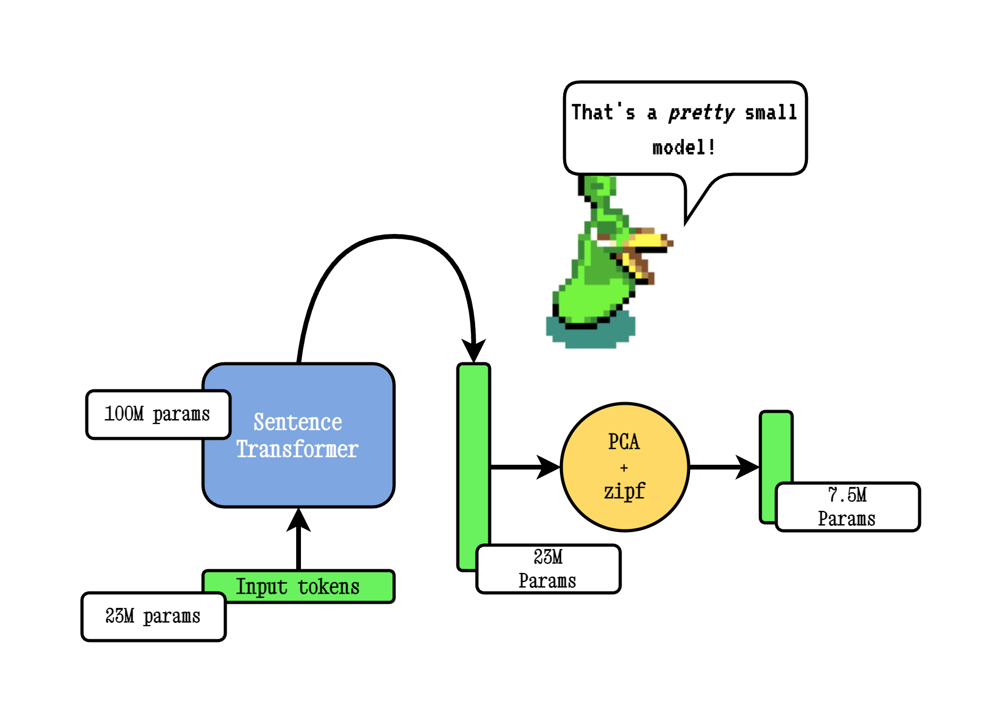
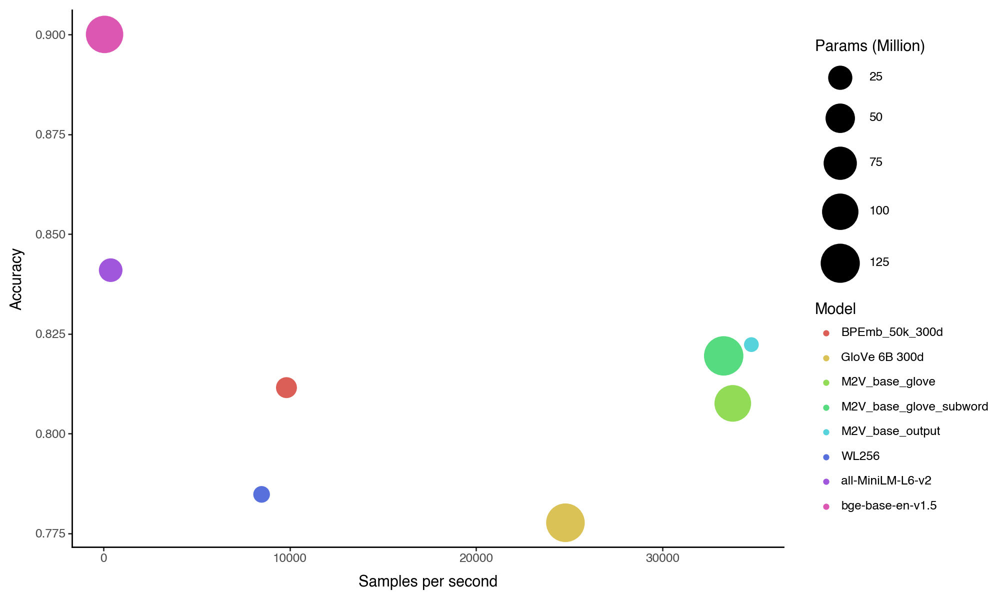

<div align="center">
    <picture>
      
    </picture>
  </a>
</div>

<div align="center">
  <h2>Distill a Small Fast Model from any Sentence Transformer</h2>
</div>

<div align="center">
  <h2>
    <a href="https://huggingface.co/minishlab"><strong>🤗 Models</strong></a> |
    <a href="https://github.com/MinishLab/model2vec/tree/main/tutorials"><strong>📚 Tutorials</strong></a> |
    <a href="https://github.com/MinishLab"><strong>📖 Website </strong></a>
  </h2>
</div>

<div align="center">
  <h2>
    <a href="https://pypi.org/project/model2vec/"></a>
    <a href="https://pypi.org/project/model2vec/"></a>
    <a href="https://pepy.tech/project/model2vec">
    
    </a>
    <a href="https://app.codecov.io/gh/MinishLab/model2vec">
    
    </a>
  </a>
    <a href="https://github.com/MinishLab/model2vec/blob/main/LICENSE"></a>
  </h2>
</div>


<p align="center">
  
</p>

Model2Vec is a technique to turn any sentence transformer into a really small fast model, reducing model size by 15x and making the models up to 500x faster, with a small drop in performance. See our results [here](#classification-and-speed-benchmarks), or dive in to see how it works.

## Table of Contents
- [Quickstart](#quickstart)
- [What is Model2Vec?](#what-is-model2vec)
- [Main Features](#main-features)
- [Usage](#usage)
    - [Distilling a Model2Vec model](#distilling-a-model2vec-model)
    - [Inferencing a Model2Vec model](#inference-with-a-model2vec-model)
    - [Evaluating a Model2Vec model](#evaluating-a-model2vec-model)
- [Model List](#model-list)
- [Results](#results)
- [Related Work](#related-work)
- [Citing](#citing)

## Quickstart

Install the package with:
```bash
pip install model2vec
```

The easiest way to get started with Model2Vec is to download one of our [flagship models from the HuggingFace hub](https://huggingface.co/minishlab). These models are pre-trained and ready to use. The following code snippet shows how to load a model and make embeddings:
```python
from model2vec import StaticModel

# Load a model from the HuggingFace hub (in this case the M2V_base_output model)
model_name = "minishlab/M2V_base_output"
model = StaticModel.from_pretrained(model_name)

# Make embeddings
embeddings = model.encode(["It's dangerous to go alone!", "It's a secret to everybody."])

# Make sequences of token embeddings
token_embeddings = model.encode_as_sequence(["It's dangerous to go alone!", "It's a secret to everybody."])
```

And that's it. You can use the model to classify texts, to cluster, or to build a RAG system.

Instead of using one of our models, you can distill your own Model2Vec model from a Sentence Transformer model. The following code snippet shows how to distill a model:
```python
from model2vec.distill import distill

# Choose a Sentence Transformer model
model_name = "BAAI/bge-base-en-v1.5"

# Distill the model
m2v_model = distill(model_name=model_name, pca_dims=256)

# Save the model
m2v_model.save_pretrained("m2v_model")
```

If you already have a model loaded, or need to load a model in some special way, we also offer an interface to distill models in memory.

```python
from transformers import AutoModel, AutoTokenizer

from model2vec.distill import distill_from_model

# Assuming a loaded model and tokenizer
model_name = "baai/bge-base-en-v1.5"
model = AutoModel.from_pretrained(model_name)
tokenizer = AutoTokenizer.from_pretrained(model_name)

m2v_model = distill_from_model(model=model, tokenizer=tokenizer, pca_dims=256)

m2v_model.save_pretrained("m2v_model")

```

Distillation is really fast, and only takes about 5 seconds on a 2024 macbook using the MPS backend, 30 seconds on CPU. Best of all, distillation requires no training data.

## What is Model2Vec?

Model2vec creates a small, fast, and powerful model that outperforms other static embedding models by a large margin on all tasks we could find, while being much faster to create than traditional static embedding models such as GloVe. Like BPEmb, it can create subword embeddings, but with much better performance. Best of all, you don't need _any_ data to distill a model using Model2Vec.

It works by passing a vocabulary through a sentence transformer model, then reducing the dimensionality of the resulting embeddings using PCA, and finally weighting the embeddings using zipf weighting. During inference, we simply take the mean of all token embeddings occurring in a sentence.

Model2vec has 3 modes:
- **Output**: behaves much like a real sentence transformer, i.e., it uses a subword tokenizer and simply encodes all wordpieces in its vocab. This is really quick to create (30 seconds on a CPU), very small (30 MB in float32), but might be less performant on some tasks.
- **Vocab (word level)**: creates a word-level tokenizer and only encodes words that are in the vocabulary. This is a bit slower to create and creates a larger model, but might be more performant on some tasks. Note that this model can go out-of-vocabulary, which might be beneficial if your domain is very noisy
- **Vocab (subword)**: a combination of the two methods above. In this mode, you can pass your own vocabulary, but it also uses the subword vocabulary to create representations for words not in the passed vocabulary.

## Main Features

Model2Vec is:

- **Small**: reduces the size of a Sentence Transformer model by a factor of 15, from 120M params, down to 7.5M (30 MB on disk!).
- **Static, but better**: smaller than GLoVe, but much more performant, even with the same vocabulary.
- **Fast distillation**: make your own model in 30 seconds.
- **Fast inference**: up to 500 times faster on CPU than the original model. Go green or go home.
- **No data needed**: Distillation happens directly on the token level, so no dataset is needed.
- **Simple to use**: An easy to use interface for distilling and inferencing.
- **Bring your own model**: Can be applied to any Sentence Transformer model.
- **Bring your own vocabulary**: Can be applied to any vocabulary, allowing you to use your own domain-specific vocabulary. Need biomedical? Just get a medical dictionary, a biomedical model, and inference it.
- **Multi-lingual**: Use any language. Need a French model? [Pick one](https://huggingface.co/models?library=sentence-transformers&language=fr&sort=trending). Need multilingual? [Here you go](https://huggingface.co/sentence-transformers/LaBSE).
- **Tightly integrated with HuggingFace hub**: easily share and load models from the HuggingFace hub, using the familiar `from_pretrained` and `push_to_hub`. Our own models can be found [here](https://huggingface.co/minishlab). Feel free to share your own.
- **Easy Evaluation**: evaluate your models on MTEB and some of our own tasks to measure the performance of the distilled model. Model2Vec models work out of the box on [MTEB](https://huggingface.co/spaces/mteb/leaderboard).

## Usage

### Distilling a Model2Vec model

Distilling a model from the output embeddings of a Sentence Transformer model. As mentioned above, this leads to really small model that might be less performant.
```python
from model2vec.distill import distill

# Choose a Sentence Transformer model
model_name = "BAAI/bge-base-en-v1.5"

# Distill the model
m2v_model = distill(model_name=model_name, pca_dims=256)

# Save the model
m2v_model.save_pretrained("m2v_model")

```

If you pass a vocabulary, you get a set of static word embeddings, together with a custom tokenizer for exactly that vocabulary. This is comparable to how you would use GLoVe or traditional word2vec, but doesn't actually require a corpus or data.
```python
from model2vec.distill import distill

# Load a vocabulary as a list of strings
vocabulary = ["word1", "word2", "word3"]
# Choose a Sentence Transformer model
model_name = "BAAI/bge-base-en-v1.5"

# Distill the model with the custom vocabulary
m2v_model = distill(model_name=model_name,
                    vocabulary=vocabulary,
                    pca_dims=None,
                    apply_zipf=True)

# Save the model
m2v_model.save_pretrained("m2v_model")

# Or push it to the hub
m2v_model.push_to_hub("my_organization/my_model", token="<it's a secret to everybody>")
```

**Important note:** we assume the passed vocabulary is sorted in rank frequency. i.e., we don't care about the actual word frequencies, but do assume that the most frequent word is first, and the least frequent word is last. If you're not sure whether this is case, set `apply_zipf` to `False`. This disables the weighting, but will also make performance a little bit worse.

We also provide a command line interface for distillation. Note that `vocab.txt` should be a file with one word per line.
```bash
python3 -m model2vec.distill --model-name BAAI/bge-base-en-v1.5 --vocabulary-path vocab.txt --device mps --save-path model2vec_model
```

### Inference with a Model2Vec model
Inference works as follows. The example shows one of our own models, but you can also just load a local one, or another one from the hub.
```python
from model2vec import StaticModel

# Load a model from the HuggingFace hub, or a local one.
model_name = "minishlab/M2V_base_output"
# You can optionally pass a token if you're loading a private model
model = StaticModel.from_pretrained(model_name, token=None)

# Make embeddings
embeddings = model.encode(["It's dangerous to go alone!", "It's a secret to everybody."])

# Make sequences of token embeddings
token_embeddings = model.encode_as_sequence(["It's dangerous to go alone!", "It's a secret to everybody."])
```

### Evaluating a Model2Vec model

Our models can be evaluated using our [evaluation package](https://github.com/MinishLab/evaluation). To run this, first install the optional evaluation package:
```bash
pip install evaluation@git+https://github.com/MinishLab/evaluation@main
```

Then, the following code snippet shows how to evaluate a Model2Vec model:
```python
from model2vec import StaticModel

from evaluation import CustomMTEB, get_tasks, parse_mteb_results, make_leaderboard, summarize_results
from mteb import ModelMeta

# Get all available tasks
tasks = get_tasks()
# Define the CustomMTEB object with the specified tasks
evaluation = CustomMTEB(tasks=tasks)

# Load the model
model_name = "m2v_model"
model = StaticModel.from_pretrained(model_name)

# Optionally, add model metadata in MTEB format
model.mteb_model_meta = ModelMeta(
            name=model_name, revision="no_revision_available", release_date=None, languages=None
        )

# Run the evaluation
results = evaluation.run(model, eval_splits=["test"], output_folder=f"results")

# Parse the results and summarize them
parsed_results = parse_mteb_results(mteb_results=results, model_name=model_name)
task_scores = summarize_results(parsed_results)

# Print the results in a leaderboard format
print(make_leaderboard(task_scores))
```

## Model List


| Model                  | Language    | Description                                                           | Vocab | Sentence Transformer | Params       |
|------------------------|-------------|-----------------------------------------------------------------------|----------------|-----------------------|--------------|
| [M2V_base_glove](https://huggingface.co/minishlab/M2V_base_glove)           | English     | Flagship embedding model based on GloVe vocab.           | GloVe        | [bge-base-en-v1.5](https://huggingface.co/BAAI/bge-base-en-v1.5)                   | 102M         |
| [M2V_base_output](https://huggingface.co/minishlab/M2V_base_output)          | English     | Flagship embedding model based on bge-base-en-v1.5 vocab. Uses a subword tokenizer.                    | Output          | [bge-base-en-v1.5](https://huggingface.co/BAAI/bge-base-en-v1.5)                         | 7.5M         |
| [M2V_base_glove_subword](https://huggingface.co/minishlab/M2V_base_glove_subword)          | English     | Flagship embedding model based on bge-base-en-v1.5 + glove vocab. Uses a subword tokenizer.                    | Output  + GloVe       | [bge-base-en-v1.5](https://huggingface.co/BAAI/bge-base-en-v1.5)                         | 103M         |
| [M2V_multilingual_output](https://huggingface.co/minishlab/M2V_multilingual_output)          | Multilingual     | Flagship multilingual embedding model based on LaBSE vocab. Uses a subword tokenizer.                    | Output          | [LaBSE](https://huggingface.co/sentence-transformers/LaBSE)                         | 471M         |
## Results

### Main Results

Model2Vec is evaluated on MTEB, as well as two additional tasks: [PEARL](https://github.com/tigerchen52/PEARL) (a phrase representation task) and WordSim (a collection of _word_ similarity tasks). The results are shown in the table below.


| Model                  | Avg (All) | Avg (MTEB) | Class  | Clust  | PairClass | Rank   | Ret    | STS    | Sum    | Pearl  | WordSim |
|:-----------------------|:---------:|:----------:|:------:|:------:|:---------:|:------:|:------:|:------:|:------:|:------:|:-------:|
| all-MiniLM-L6-v2        | 56.08     | 56.09      | 62.62  | 41.94  | 82.37     | 58.04  | 41.95  | 78.90  | 30.81  | 60.83  | 49.91   |
| M2V_base_glove_subword  | 49.06     | 46.69      | 61.27  | 30.03  | 74.71     | 49.15  | 27.16  | 69.09  | 30.08  | 56.82  | 57.99   |
| M2V_base_glove          | 48.58     | 47.60      | 61.35  | 30.52  | 75.34     | 48.50  | 29.26  | 70.31  | 31.50  | 50.28  | 54.29   |
| M2V_base_output         | 46.79     | 45.34      | 61.25  | 25.58  | 74.90     | 47.63  | 26.14  | 68.58  | 29.20  | 54.02  | 49.18   |
| GloVe_300d              | 42.84     | 42.36      | 57.31  | 27.66  | 72.48     | 43.30  | 22.78  | 61.90  | 28.81  | 45.65  | 43.05   |
| BPEmb_50k_300d          | 39.34     | 37.78      | 55.76  | 23.35  | 57.86     | 43.21  | 17.50  | 55.10  | 29.74  | 47.56  | 41.28   |
| WL256*                  | 48.88     | 49.36      | 58.98  | 33.34  | 74.00     | 52.03  | 33.12  | 73.34  | 29.05  | 48.81  | 45.16   |


<details>
  <summary>  Task Abbreviations </summary>

For readability, the MTEB task names are abbreviated as follows:
- Class: Classification
- Clust: Clustering
- PairClass: PairClassification
- Rank: Reranking
- Ret: Retrieval
- STS: Semantic Textual Similarity
- Sum: Summarization
</details>

\
\* WL256, introduced in the [WordLlama](https://github.com/dleemiller/WordLlama/tree/main) package is included for comparison due to its similarities to Model2Vec. However, we believe it is heavily overfit to the MTEB dataset since it is trained on datasets used in MTEB itself. This can be seen by the fact that the WL256 model performs much worse on the non-MTEB tasks (PEARL and WordSim) than our models and GLoVe. The results shown in the [Classification and Speed Benchmarks](#classification-and-speed-benchmarks) further support this.

### Classification and Speed Benchmarks

In addition to the MTEB evaluation, we evaluate Model2Vec on a number of classification datasets. These are used as additional evidence to avoid overfitting to the MTEB dataset and to benchmark the speed of the model. The results are shown in the table below.


| Model                  | Average | SST2   | IMDB  | TREC   | AG News |
|:-----------------------|:-------:|:------:|:-----:|:------:|:-------:|
| bge-base-en-v1.5        | 90.00   | 91.54  | 91.88 | 85.16  | 91.45   |
| all-MiniLM-L6-v2        | 84.10   | 83.95  | 81.36 | 81.31  | 89.77   |
| M2V_base_output         | 82.23   | 80.92  | 84.56 | 75.27  | 88.17   |
| M2V_base_glove_subword  | 81.95   | 82.84  | 85.96 | 70.51  | 88.49   |
| BPEmb_50k_300d          | 81.15   | 80.42  | 84.04 | 71.25  | 88.92   |
| M2V_base_glove          | 80.76   | 83.07  | 85.24 | 66.12  | 88.61   |
| WL256                   | 78.48   | 76.88  | 80.12 | 69.23  | 87.68   |
| GloVe_300d              | 77.77   | 81.68  | 84.00 | 55.67  | 89.71   |


As can be seen, Model2Vec models outperform the GloVe, BPEmb, and WL256 models on all classification tasks, and are competitive with the all-MiniLM-L6-v2 model, while being much faster.

The figure below shows the relationship between the number of sentences per second and the average classification score. The circle sizes correspond to the number of parameters in the models (larger = more parameters).
This plot shows that the Model2Vec models are much faster than the other models, while still being competitive in terms of classification performance with the [all-MiniLM-L6-v2](https://huggingface.co/sentence-transformers/all-MiniLM-L6-v2) model.

|  |
|:--:|
|*Figure: The average accuracy over all classification datasets plotted against sentence per second. The circle size indicates model size.*|

## Related work

If you are interested in fast small models, also consider looking at these techniques:
* [BPEmb](https://bpemb.h-its.org/): GLoVE embeddings trained on BPE-encoded Wikipedias. Huge inspiration to this project, multilingual, very fast. If you don't find a sentence transformer in the language you need, check this out.
* [fast-sentence-transformers](https://github.com/davidberenstein1957/fast-sentence-transformers): distillation using Model2Vec comes at a cost. If that cost is too steep for you, and you have access to a GPU, this package is for you. It automates the quantization and optimization of sentence transformers without loss of performance.
* [wordllama](https://github.com/dleemiller/WordLlama): Uses the _input_ embeddings of a LLama2 model and then performs contrastive learning on these embeddings. As we show above, we think this is a bit overfit on MTEB, as the model is trained on MTEB datasets, and only evaluated on MTEB. It provides an interesting point of comparison to Model2Vec, and, fun fact, was invented at the same time.

If you find other related work, please let us know.

## License

MIT

## Citing

If you use Model2Vec in your research, please cite the following:
```bibtex
@software{minishlab2024model2vec,
  authors = {Stephan Tulkens, Thomas van Dongen},
  title = {Model2Vec: Turn any Sentence Transformer into a Small Fast Model},
  year = {2024},
  url = {https://github.com/MinishLab/model2vec},
}
```
