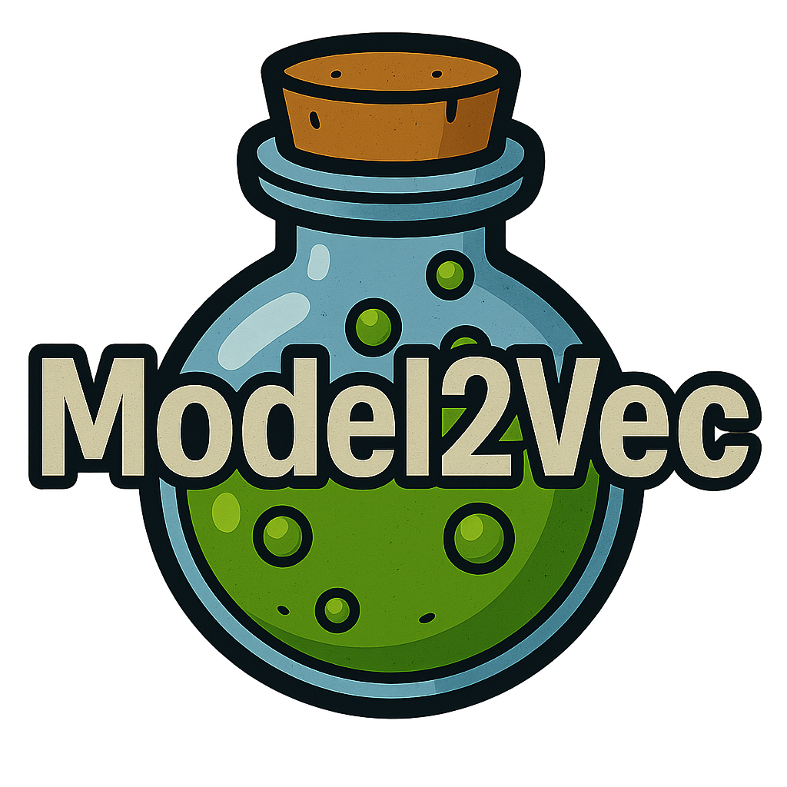

<h2 align="center">
  <br/>
  Fast State-of-the-Art Static Embeddings
</h2>


<div align="center">
  <h2>
    <a href="https://huggingface.co/minishlab"><strong>🤗 Models</strong></a> |
    <a href="https://minish.ai/packages/model2vec/introduction"><strong>📖 Docs</strong></a> |
    <a href="https://github.com/MinishLab/model2vec/blob/main/results/README.md"><strong>🏆 Results</strong></a> |
    <a href="https://github.com/MinishLab/model2vec/tree/main/tutorials"><strong>📚 Tutorials</strong></a> |
    <a href="https://minish.ai/blog"><strong>🌐 Blog</strong></a>
</div>

<div align="center">
  <h2>
    <a href="https://pypi.org/project/model2vec/"></a>
    <a href="https://minish.ai/packages/model2vec/introduction"></a>
    <a href="https://pepy.tech/project/model2vec">
      
    </a>
    <a href="https://app.codecov.io/gh/MinishLab/model2vec">
      
    </a>
    <a href="https://discord.gg/4BDPR5nmtK">
      
    </a>
    <a href="https://github.com/MinishLab/model2vec/blob/main/LICENSE">
      
    </a>
    <a href="https://github.com/MinishLab/model2vec/stargazers">
      
    </a>
  </h2>
</div>


Model2Vec is a technique to turn any sentence transformer into a small, fast static embedding model. Model2Vec reduces model size by a factor up to 50 and makes models up to 500 times faster, with a small drop in performance. Our [best model](https://huggingface.co/minishlab/potion-base-32M) is the most performant static embedding model in the world. See our [results](results/README.md), read our [docs](https://minish.ai/packages/model2vec/introduction), or dive in to see how it works.

<div align="center">
<h3>

[Quickstart](#quickstart) • [Updates & Announcements](#updates--announcements) • [Main Features](#main-features) • [Model List](#model-list)
</h3>
</div>

## Quickstart

Install the lightweight base package with:

```bash
pip install model2vec
```

You can start using Model2Vec by loading one of our [flagship models from the HuggingFace hub](https://huggingface.co/collections/minishlab/potion-6721e0abd4ea41881417f062). These models are pre-trained and ready to use. The following code snippet shows how to load a model and make embeddings, which you can use for any task, such as  text classification, retrieval, clustering, or building a RAG system:
```python
from model2vec import StaticModel

# Load a model from the HuggingFace hub (in this case the potion-base-32M model)
model = StaticModel.from_pretrained("minishlab/potion-base-32M")

# Make embeddings
embeddings = model.encode(["It's dangerous to go alone!", "It's a secret to everybody."])

# Make sequences of token embeddings
token_embeddings = model.encode_as_sequence(["It's dangerous to go alone!", "It's a secret to everybody."])
```
For advanced usage, see our [inference docs](https://minish.ai/packages/model2vec/inference). Instead of using one of our models, you can also distill your own Model2Vec model from a Sentence Transformer model. First, install the `distillation` extras with:

```bash
pip install model2vec[distill]
```


Then, you can distill a model in ~30 seconds on a CPU with the following code snippet:

```python
from model2vec.distill import distill

# Distill a Sentence Transformer model, in this case the BAAI/bge-base-en-v1.5 model
m2v_model = distill(model_name="BAAI/bge-base-en-v1.5")

# Save the model
m2v_model.save_pretrained("m2v_model")
```

For advanced usage, see our [distillation docs](https://minish.ai/packages/model2vec/distillation), which includes some [distillation best practices](https://minish.ai/packages/model2vec/distillation#distillation-best-practices). After distillation, you can also fine-tune your own classification models on top of the distilled model, or on a pre-trained model. First, make sure you install the `training` extras with:

```bash
pip install model2vec[train]
```

Then, you can fine-tune a model as follows:

```python
import numpy as np
from datasets import load_dataset
from model2vec.train import StaticModelForClassification

# Initialize a classifier from a pre-trained model
classifier = StaticModelForClassification.from_pretrained(model_name="minishlab/potion-base-32M")

# Load a dataset. Note: both single and multi-label classification datasets are supported
ds = load_dataset("setfit/subj")

# Train the classifier on text (X) and labels (y)
classifier.fit(ds["train"]["text"], ds["train"]["label"])

# Evaluate the classifier
classification_report = classifier.evaluate(ds["test"]["text"], ds["test"]["label"])
```

For advanced usage, see our [training docs](https://minish.ai/packages/model2vec/training).

## Updates & Announcements

- **23/05/2025**: We released [potion-multilingual-128M](https://huggingface.co/minishlab/potion-multilingual-128M), a multilingual model trained on 101 languages. It is the best performing static embedding model for multilingual tasks, and is capable of generating embeddings for any text in any language. The results can be found in our [results](results/README.md#mmteb-results-multilingual) section.

- **01/05/2025**: We released backend support for `BPE` and `Unigram` tokenizers, along with quantization and dimensionality reduction. New Model2Vec models are now 50% of the original models size, and can be quantized to int8 to be 25% of the size, without loss of performance.

- **12/02/2025**: We released **Model2Vec training**, allowing you to fine-tune your own classification models on top of Model2Vec models. Find out more in our [training documentation](https://github.com/MinishLab/model2vec/blob/main/model2vec/train/README.md) and [results](results/README.md#training-results).

- **30/01/2025**: We released two new models: [potion-base-32M](https://huggingface.co/minishlab/potion-base-32M) and [potion-retrieval-32M](https://huggingface.co/minishlab/potion-retrieval-32M). [potion-base-32M](https://huggingface.co/minishlab/potion-base-32M) is our most performant model to date, using a larger vocabulary and higher dimensions. [potion-retrieval-32M](https://huggingface.co/minishlab/potion-retrieval-32M) is a finetune of [potion-base-32M](https://huggingface.co/minishlab/potion-base-32M) that is optimized for retrieval tasks, and is the best performing static retrieval model currently available.

- **30/10/2024**: We released three new models: [potion-base-8M](https://huggingface.co/minishlab/potion-base-8M), [potion-base-4M](https://huggingface.co/minishlab/potion-base-4M), and [potion-base-2M](https://huggingface.co/minishlab/potion-base-2M). These models are trained using [Tokenlearn](https://github.com/MinishLab/tokenlearn). Find out more in our [blog post](https://minishlab.github.io/tokenlearn_blogpost/). NOTE: for users of any of our old English M2V models, we recommend switching to these new models as they [perform better on all tasks](https://github.com/MinishLab/model2vec/tree/main/results).

## Main Features

- **State-of-the-Art Performance**: Model2Vec models outperform any other static embeddings (such as GLoVe and BPEmb) by a large margin, as can be seen in our [results](results/README.md).
- **Small**: Model2Vec reduces the size of a Sentence Transformer model by a factor of up to 50. Our [best model](https://huggingface.co/minishlab/potion-base-8M) is just ~30 MB on disk, and our smallest model just ~8 MB (making it the smallest model on [MTEB](https://huggingface.co/spaces/mteb/leaderboard)!).
- **Lightweight Dependencies**: the base package's only major dependency is `numpy`.
- **Lightning-fast Inference**: up to 500 times faster on CPU than the original model.
- **Fast, Dataset-free Distillation**: distill your own model in 30 seconds on a CPU, without a dataset.
- **Fine-tuning**: fine-tune your own classification models on top of Model2Vec models.
- **Integrated in many popular libraries**: Model2Vec is integrated direclty into popular libraries such as [Sentence Transformers](https://github.com/UKPLab/sentence-transformers) and [LangChain](https://github.com/langchain-ai/langchain). For more information, see our [integrations documentation](https://minish.ai/packages/model2vec/integrations).
- **Tightly integrated with HuggingFace hub**: easily share and load models from the HuggingFace hub, using the familiar `from_pretrained` and `push_to_hub`. Our own models can be found [here](https://huggingface.co/minishlab).

## What is Model2Vec?

Model2vec creates a small, fast, and powerful model that outperforms other static embedding models by a large margin on all tasks we could find, while being much faster to create than traditional static embedding models such as GloVe. Like BPEmb, it can create subword embeddings, but with much better performance. Distillation doesn't need _any_ data, just a vocabulary and a model.

The core idea is to forward pass a vocabulary through a sentence transformer model, creating static embeddings for the indiviudal tokens. After this, there are a number of post-processing steps we do that results in our best models, as well as an optional pre-training step to further boost performance. For a more extensive deepdive, please refer to our [official documentation on how Model2Vec works](https://minish.ai/packages/model2vec/introduction#how-mode2vec-works).

## Documentation

Our official documentation can be found [here](https://minish.ai/packages/model2vec/introduction). This includes in-depth documentation on [inference](https://minish.ai/packages/model2vec/inference), [distillation](https://minish.ai/packages/model2vec/distillation), [training](https://minish.ai/packages/model2vec/training), and [integrations](https://minish.ai/packages/model2vec/integrations).


## Model List

We provide a number of models that can be used out of the box. These models are available on the [HuggingFace hub](https://huggingface.co/collections/minishlab/model2vec-base-models-66fd9dd9b7c3b3c0f25ca90e) and can be loaded using the `from_pretrained` method. The models are listed below.


| Model                                                                 | Language    | Sentence Transformer                                            | Params  | Task      |
|-----------------------------------------------------------------------|------------|-----------------------------------------------------------------|---------|-----------|
| [potion-base-32M](https://huggingface.co/minishlab/potion-base-32M)   | English    | [bge-base-en-v1.5](https://huggingface.co/BAAI/bge-base-en-v1.5) | 32.3M   | General   |
| [potion-multilingual-128M](https://huggingface.co/minishlab/potion-multilingual-128M) | Multilingual | [bge-m3](https://huggingface.co/BAAI/bge-m3)      | 128M    | General   |
| [potion-retrieval-32M](https://huggingface.co/minishlab/potion-retrieval-32M) | English    | [bge-base-en-v1.5](https://huggingface.co/BAAI/bge-base-en-v1.5) | 32.3M   | Retrieval |
| [potion-base-8M](https://huggingface.co/minishlab/potion-base-8M)     | English    | [bge-base-en-v1.5](https://huggingface.co/BAAI/bge-base-en-v1.5) | 7.5M    | General   |
| [potion-base-4M](https://huggingface.co/minishlab/potion-base-4M)     | English    | [bge-base-en-v1.5](https://huggingface.co/BAAI/bge-base-en-v1.5) | 3.7M    | General   |
| [potion-base-2M](https://huggingface.co/minishlab/potion-base-2M)     | English    | [bge-base-en-v1.5](https://huggingface.co/BAAI/bge-base-en-v1.5) | 1.8M    | General   |


## Results

We have performed extensive experiments to evaluate the performance of Model2Vec models. The results are documented in the [results](results/README.md) folder. The results are presented in the following sections:
- [MTEB Results](results/README.md#mteb-results)
- [MMTEB Results](results/README.md#mmteb-results)
- [Retrieval Results](results/README.md#retrieval-results)
- [Training Results](results/README.md#training-results)
- [Ablations](results/README.md#ablations)

## License

MIT

## Citing

If you use Model2Vec in your research, please cite the following:

```bibtex
@software{minishlab2024model2vec,
  author       = {Stephan Tulkens and {van Dongen}, Thomas},
  title        = {Model2Vec: Fast State-of-the-Art Static Embeddings},
  year         = {2024},
  publisher    = {Zenodo},
  doi          = {10.5281/zenodo.17270888},
  url          = {https://github.com/MinishLab/model2vec},
  license      = {MIT}
}
```


## 🌐 Web Resources & Interactive Index
- [TWILIGHT SOLITAIRE TRIPEAKS](https://themindplays.pages.dev/twilight-solitaire-tripeaks.html)
- [PLANTS VS ZOMBIES WAR](https://studyquesthub.web.app/plants-vs-zombies-war.html)
- [TAP OUT PUZZLE](https://iskillquest.pages.dev/tap-out-puzzle.html)
- [MIGHTY RUN](https://learnquesters.pages.dev/mighty-run.html)
- [CATEGORY RACING DRIVING 3](https://themindzone.pages.dev/category-racing-driving-3.html)
- [BRAIN TEST ONE LINE DRAW PUZZLE](https://studyquests.pages.dev/brain-test-one-line-draw-puzzle.html)
- [CLONEUP STACK YOURSELF](https://thequizzone.pages.dev/cloneup-stack-yourself.html)
- [SCARY PAIRS](https://studyplayings.web.app/scary-pairs.html)
- [OVERPROTECTIVE BOYFRIEND](https://theskillquest.pages.dev/overprotective-boyfriend.html)
- [CLAP CLAP NIGHTMARE](https://themindzone.pages.dev/clap-clap-nightmare.html)
- [DRAW TO SMASH ZOMBIE](https://studyplaying.github.io/draw-to-smash-zombie.html)
- [TOY CARS 3D RACING](https://learnquester.github.io/toy-cars-3d-racing.html)
- [BESTIES CHINESE NEW YEAR CELEBRATION](https://thequizzone.pages.dev/besties-chinese-new-year-celebration.html)
- [CATEGORY PUZZLE 3](https://studyplaying.github.io/category-puzzle-3.html)
- [CATEGORY CARE](https://quizverses.github.io/category-care.html)
- [WITCHY SISTERS RELAX PUZZLE](https://studyquests.pages.dev/witchy-sisters-relax-puzzle.html)
- [BEAT MUSIC BATTLE](https://studyplaying.github.io/beat-music-battle.html)
- [SITEMAP](https://quizverses.pages.dev/sitemap.html)
- [DINO RANCH](https://iskillquest.pages.dev/dino-ranch.html)
- [KNIT RESCUE](https://theskillquest.pages.dev/knit-rescue.html)
- [HIGHSCHOOL MEAN GIRLS 3](https://themindzone.pages.dev/highschool-mean-girls-3.html)
- [FACE CHANGES](https://iskillquest.pages.dev/face-changes.html)
- [INDEX19](https://studyplaying.github.io/index19.html)
- [TANGLE MASTER 3D](https://themindzone.pages.dev/tangle-master-3d.html)
- [CATEGORY RELAXING223](https://themindzone.pages.dev/category-relaxing223.html)
- [NUTS AND BOLTS SCREW PUZZLE](https://iskillquest.pages.dev/nuts-and-bolts-screw-puzzle.html)
- [ESCAPE FROM THE PORTAL](https://theskillquest.pages.dev/escape-from-the-portal.html)
- [CRAZYSTEVEIO](https://studyplayings.pages.dev/crazysteveio.html)
- [BACKROOMS AMONG IMPOSTOR ROLLING GIANT](https://iskillquest.pages.dev/backrooms-among-impostor-rolling-giant.html)
- [BULL RUNNER](https://studyquests.pages.dev/bull-runner.html)
- [SEEK FIND](https://thequizzone.pages.dev/seek-find.html)
- [INDEX35](https://studyplaying.github.io/index35.html)
- [INDEX9](https://studyplayings.pages.dev/index9.html)
- [CATEGORY BATTLE ROYALE](https://themindzone.pages.dev/category-battle-royale.html)
- [CITYQUEST](https://studyquesthub.web.app/cityquest.html)
- [HOTEL FEVER TYCOON](https://quizverses-9d2f2.web.app/hotel-fever-tycoon.html)
- [SNAKE 2048](https://studyplaying.github.io/snake-2048.html)
- [CATEGORY FPS 3](https://iskillquest.pages.dev/category-fps-3.html)
- [HUNGRY CORGI CUTE MUSIC GAME](https://themindzone.pages.dev/hungry-corgi-cute-music-game.html)
- [INDEX4](https://iskillquest.pages.dev/index4.html)
- [MONSTER SCHOOL 3](https://themindzone.pages.dev/monster-school-3.html)
- [BUBBLE SHOOTER GO](https://iskillquest.pages.dev/bubble-shooter-go.html)
- [SISYPHUS SIMULATOR](https://studyplayings.pages.dev/sisyphus-simulator.html)
- [CAR PAINT](https://studyquests.github.io/car-paint.html)
- [INDEX7](https://studyplayings.pages.dev/index7.html)
- [FISH JAM](https://studyplayings.web.app/fish-jam.html)
- [3D KID SLIDING PUZZLE](https://theskillquest.pages.dev/3d-kid-sliding-puzzle.html)
- [CATEGORY ADVENTURE 2](https://themindzone.pages.dev/category-adventure-2.html)
- [CATEGORY CUTE](https://quizverses.github.io/category-cute.html)
- [TSUNAMI BRAINROTS ONLINE](https://quizverses-9d2f2.web.app/tsunami-brainrots-online.html)
- [RELAY RACE](https://iskillquest.pages.dev/relay-race.html)
- [LION FAMILY SIM ONLINE](https://thelearnquester.web.app/lion-family-sim-online.html)
- [JUNGLE SOLITAIRE](https://thequizzone.pages.dev/jungle-solitaire.html)
- [PESKY MOLES](https://learnquester.github.io/pesky-moles.html)
- [DEAD FACES CLONE ONLINE](https://studyquests.github.io/dead-faces-clone-online.html)
- [ROLLER COASTER 3D](https://learnquester.github.io/roller-coaster-3d.html)
- [ANTS EMPIRE EVOLVE SIM](https://studyquests.github.io/ants-empire-evolve-sim.html)
- [GTA GRAND VEGAS CRIME](https://quizverses-9d2f2.web.app/gta-grand-vegas-crime.html)
- [MAHJONG MASTERS](https://studyplaying.github.io/mahjong-masters.html)
- [SITEMAP](https://brainquests-fb2c5.web.app/sitemap.html)
- [FRUITY CRAFT MERGE](https://thequizzone.pages.dev/fruity-craft-merge.html)
- [CATEGORY THINKY 2](https://themindzone.pages.dev/category-thinky-2.html)
- [ROBYBOX SPACE STATION WAREHOUSE](https://thequizzone.pages.dev/robybox-space-station-warehouse.html)
- [ITALIAN BRAINROT QUIZ](https://learnquester.github.io/italian-brainrot-quiz.html)
- [PIXEL PATH](https://iskillquest.pages.dev/pixel-path.html)
- [PLANET EVOLUTION IDLE CLICKER](https://thequizzone.pages.dev/planet-evolution-idle-clicker.html)
- [FAMILY TREE PUZZLE](https://studyquests.github.io/family-tree-puzzle.html)
- [CATEGORY MATH29](https://quizverses-9d2f2.web.app/category-math29.html)
- [MERGE ARCHER DEFENSE](https://quizverses.github.io/merge-archer-defense.html)
- [THREAD MATCH 2](https://quizverses.github.io/thread-match-2.html)
- [PAWS PALS DINER](https://studyquests.github.io/paws-pals-diner.html)
- [INDEX24](https://iskillquest.pages.dev/index24.html)
- [BUBBLE SORTING INFINITE REMASTERED](https://quizverses.pages.dev/bubble-sorting-infinite-remastered.html)
- [CANDY CASCADE](https://themindzone.pages.dev/candy-cascade.html)
- [ITALIAN BRAINROT IN GEOMETRY DASH](https://iskillquest.pages.dev/italian-brainrot-in-geometry-dash.html)
- [BRAINROT CLICK TO HATCH](https://studyplaying.github.io/brainrot-click-to-hatch.html)
- [OBBY VS ZOMBIES](https://learnquester.github.io/obby-vs-zombies.html)
- [LEXY](https://thequizzone.pages.dev/lexy.html)
- [CUBE KING](https://studyquests.pages.dev/cube-king.html)
- [PAPER WARS BATTLES AND UPGRADES](https://thequizzone.pages.dev/paper-wars-battles-and-upgrades.html)
- [PULL THE PIN FISH RESCUE](https://thequizzone.pages.dev/pull-the-pin-fish-rescue.html)
- [COLOR BUMP DANCER](https://theskillquest.pages.dev/color-bump-dancer.html)
- [FOONO ONLINE MULTIPLAYER CARD GAME](https://studyquesthub.web.app/foono-online-multiplayer-card-game.html)
- [CIRCLE RUN ENDLESS](https://thequizzone.pages.dev/circle-run-endless.html)
- [HOME RUSH THE FISH WAR](https://theskillquest.pages.dev/home-rush-the-fish-war.html)
- [SUPER ELIP ADVENTURE](https://iskillquest.pages.dev/super-elip-adventure.html)
- [MEGA LAMBA RAMP](https://quizverses-9d2f2.web.app/mega-lamba-ramp.html)
- [MOW IT](https://studyquests.github.io/mow-it.html)
- [THE BEST WARRIOR](https://learnquester.github.io/the-best-warrior.html)
- [FOOD TRUCK CHEF COOKING](https://studyquests.github.io/food-truck-chef-cooking.html)
- [ARROW WAVE](https://theskillquest.pages.dev/arrow-wave.html)
- [CHICKEN BLAST](https://iskillquest.pages.dev/chicken-blast.html)
- [STICKMAN WARRIOR WAY](https://studyquests.pages.dev/stickman-warrior-way.html)
- [GUN SHOOTING RANGE](https://theskillquest.pages.dev/gun-shooting-range.html)
- [PIRATES MAHJONG](https://studyplaying.github.io/pirates-mahjong.html)
- [ICONIC HALLOWEEN COSTUMES](https://studyplaying.github.io/iconic-halloween-costumes.html)
- [INDEX21](https://themindzone.pages.dev/index21.html)
- [STICKBOYS HOOK](https://quizverses-9d2f2.web.app/stickboys-hook.html)
- [CATEGORY PUZZLE 2](https://themindzone.pages.dev/category-puzzle-2.html)
- [HAPPY JUMP](https://thequizzone.pages.dev/happy-jump.html)
- [EVONY THE KINGS RETURN](https://iskillquest.pages.dev/evony-the-kings-return.html)
- [HUNGRY SNAKE IO](https://iskillquest.pages.dev/hungry-snake-io.html)
- [AMMO RUSH MASTER](https://studyplaying.github.io/ammo-rush-master.html)
- [NOOBHOOD HALLOWEENCRAFT](https://iskillquest.pages.dev/noobhood-halloweencraft.html)
- [BRAINROT CLICKER](https://learnquester.github.io/brainrot-clicker.html)
- [CHRISTMAS FIND THE DIFFERENCES](https://iskillquest.pages.dev/christmas-find-the-differences.html)
- [MY CAKE SHOP BAKE SERVE](https://iskillquest.pages.dev/my-cake-shop-bake-serve.html)
- [ELEVATOR FIGHT](https://themindzone.pages.dev/elevator-fight.html)
- [PUZZLE FEVER](https://thequizzone.pages.dev/puzzle-fever.html)
- [INDEX22](https://iskillplay.web.app/index22.html)
- [MAGIC FOREST MERGE THE SECRETS](https://skillplay.github.io/magic-forest-merge-the-secrets.html)
- [FIND IT OUT COLORFUL BOOK](https://studyquesthub.web.app/find-it-out-colorful-book.html)
- [WOOD COLOR BLOCK](https://iskillquest.pages.dev/wood-color-block.html)
- [CATEGORY FLASH 2](https://themindskillplayplay.pages.dev/category-flash-2.html)
- [FARM TILES HARVEST](https://iskillquest.pages.dev/farm-tiles-harvest.html)
- [FOOTBALL LEGENDS 2026](https://iskillquest.pages.dev/football-legends-2026.html)
- [MIRRORS PUZZLE](https://learnquester.github.io/mirrors-puzzle.html)
- [NUMBER RUSH](https://studyplayings.pages.dev/number-rush.html)
- [CATEGORY CASUAL 3](https://themindskillplayplay.pages.dev/category-casual-3.html)
- [RIDDLEMATH](https://studyplaying.github.io/riddlemath.html)
- [CAR PARKING SIMULATOR](https://studyplayings.pages.dev/car-parking-simulator.html)
- [CAPYBARA BLOCK BLAST](https://themindplay.pages.dev/capybara-block-blast.html)
- [CRASH CAR PARKOUR SIMULATOR](https://skillplay.github.io/crash-car-parkour-simulator.html)
- [SERIOUS HEAD 2](https://studyquests.pages.dev/serious-head-2.html)
- [CITY BIKE RACING CHAMPION](https://iskillquest.pages.dev/city-bike-racing-champion.html)
- [MINETAP](https://thequizzone.pages.dev/minetap.html)
- [MEOW SLIDE](https://learnquester.github.io/meow-slide.html)
- [HOLE AND FILL COLLECT MASTER](https://themindplay.pages.dev/hole-and-fill-collect-master.html)
- [CATEGORY FARMING87](https://quizverses.github.io/category-farming87.html)
- [RELAX MINI GAMES COLLECTION](https://studyplaying.github.io/relax-mini-games-collection.html)
