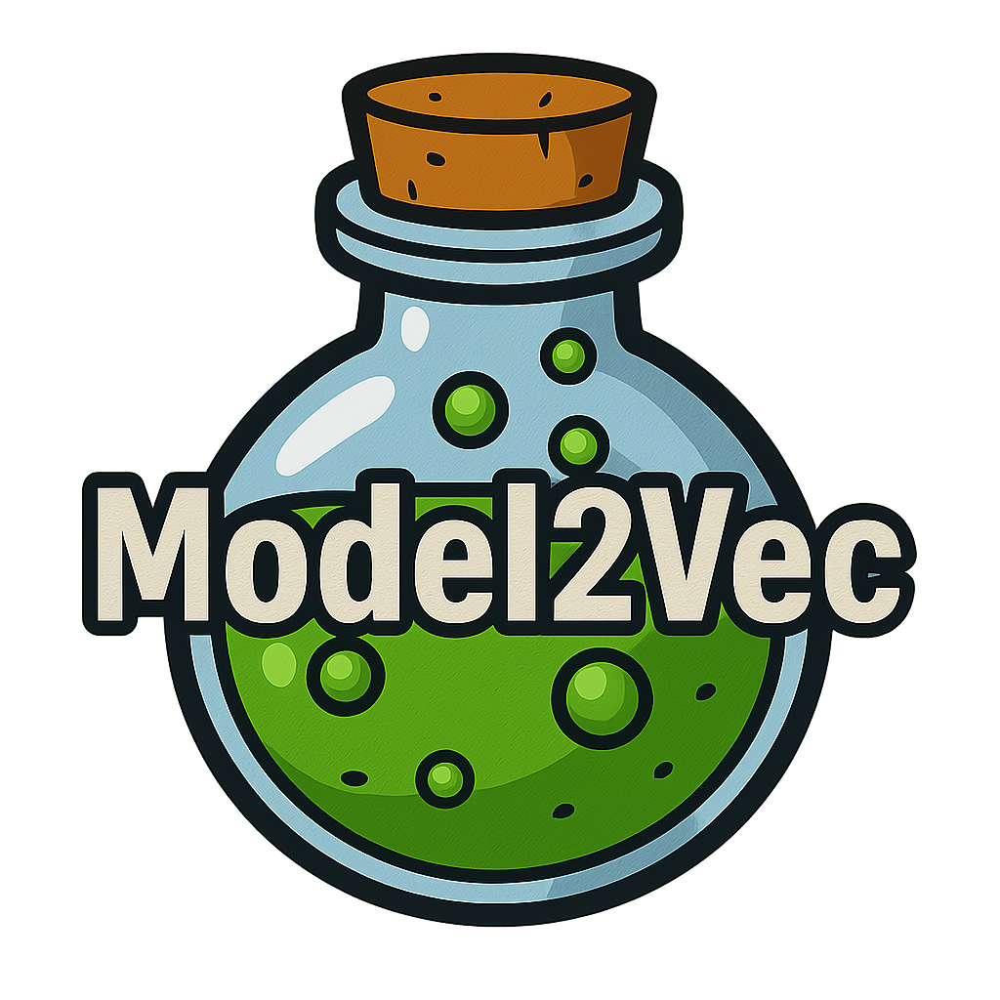

<div align="center">
    <picture>
      
    </picture>
  </a>
</div>

<div align="center">
  <h2>Distill a Small Static Model from any Sentence Transformer</h2>
</div>

<div align="center">
  <h2>
    <a href="https://huggingface.co/minishlab"><strong>🤗 Models</strong></a> |
    <a href="https://github.com/MinishLab/model2vec/tree/main/tutorials"><strong>📚 Tutorials</strong></a> |
    <a href="https://huggingface.co/blog/Pringled/model2vec"><strong>📖 Blog</strong></a> |
    <a href="https://github.com/MinishLab/model2vec/blob/main/results/README.md"><strong>🏆 Results</strong></a>
  </h2>
</div>

<div align="center">
  <h2>
    <a href="https://pypi.org/project/model2vec/"></a>
    <a href="https://pypi.org/project/model2vec/"></a>
    <a href="https://pepy.tech/project/model2vec">
    
    </a>
    <a href="https://app.codecov.io/gh/MinishLab/model2vec">
    
    </a>
  </a>
    <a href="https://github.com/MinishLab/model2vec/blob/main/LICENSE"></a>
  </h2>
</div>

<div align="center">
    
    
</div>

Model2Vec is a technique to turn any sentence transformer into a really small static model, reducing model size by 15x and making the models up to 500x faster, with a small drop in performance. See our results [here](results/README.md), or dive in to see how it works.


## Updates & Announcements

- **30/10/2024**: We released three new models: [potion-base-8M](https://huggingface.co/minishlab/potion-base-8M), [potion-base-4M](https://huggingface.co/minishlab/potion-base-4M), and [potion-base-2M](https://huggingface.co/minishlab/potion-base-2M). These models are trained using [Tokenlearn](https://github.com/MinishLab/tokenlearn). Find out more in our [blog post](https://minishlab.github.io/tokenlearn_blogpost/). NOTE: for users of any of our old English M2V models, we recommend switching to these new models as they [perform better on all tasks](https://github.com/MinishLab/model2vec/tree/main/results).

## Table of Contents
- [Quickstart](#quickstart)
- [Main Features](#main-features)
- [What is Model2Vec?](#what-is-model2vec)
- [Usage](#usage)
    - [Distillation](#distillation)
    - [Inference](#inference)
    - [Evaluation](#evaluation)
    - [Integrations](#integrations)
- [Model List](#model-list)
- [Results](#results)
- [Related Work](#related-work)
- [Citing](#citing)

## Quickstart

Install the package and all required extras with:
```bash
pip install model2vec[distill]
```

If you want a light-weight version of the package which only requires `numpy`, omit the `distill` extra. This means you can't distill your own models, but you can use pre-trained models. This is useful for inference pipelines.

```bash
pip install model2vec
```

The easiest way to get started with Model2Vec is to download one of our [flagship models from the HuggingFace hub](https://huggingface.co/minishlab). These models are pre-trained and ready to use. The following code snippet shows how to load a model and make embeddings:
```python
from model2vec import StaticModel

# Load a model from the HuggingFace hub (in this case the potion-base-8M model)
model_name = "minishlab/potion-base-8M"
model = StaticModel.from_pretrained(model_name)

# Make embeddings
embeddings = model.encode(["It's dangerous to go alone!", "It's a secret to everybody."])

# Make sequences of token embeddings
token_embeddings = model.encode_as_sequence(["It's dangerous to go alone!", "It's a secret to everybody."])
```

And that's it. You can use the model to classify texts, to cluster, or to build a RAG system.

Instead of using one of our models, you can distill your own Model2Vec model from a Sentence Transformer model. The following code snippet shows how to distill a model:
```python
from model2vec.distill import distill

# Choose a Sentence Transformer model
model_name = "BAAI/bge-base-en-v1.5"

# Distill the model
m2v_model = distill(model_name=model_name, pca_dims=256)

# Save the model
m2v_model.save_pretrained("m2v_model")
```

Distillation is really fast, and only takes about 5 seconds on a 2024 macbook using the MPS backend, 30 seconds on CPU. Best of all, distillation requires no training data.

You can also directly use Model2Vec in [Sentence Transformers](https://github.com/UKPLab/sentence-transformers) using the [StaticEmbedding](https://github.com/UKPLab/sentence-transformers/blob/master/sentence_transformers/models/StaticEmbedding.py) module. You can either load a Model2Vec model into a Sentence Transformer with the following code snippet:
```python
from sentence_transformers import SentenceTransformer
from sentence_transformers.models import StaticEmbedding

# Initialize a StaticEmbedding module
static_embedding = StaticEmbedding.from_model2vec("minishlab/potion-base-8M")
model = SentenceTransformer(modules=[static_embedding])
embeddings = model.encode(["It's dangerous to go alone!", "It's a secret to everybody."])
```

Or you can distill a model directly into a Sentence Transformer model:
```python
from sentence_transformers import SentenceTransformer
from sentence_transformers.models import StaticEmbedding

static_embedding = StaticEmbedding.from_distillation("BAAI/bge-base-en-v1.5", device="cpu", pca_dims=256)
model = SentenceTransformer(modules=[static_embedding])
embeddings = model.encode(["It's dangerous to go alone!", "It's a secret to everybody."])
```
For more documentation, please refer to the [Sentence Transformers documentation](https://sbert.net/docs/package_reference/sentence_transformer/models.html#sentence_transformers.models.StaticEmbedding).

## Main Features

Model2Vec has the following features:

- **Small**: reduces the size of a Sentence Transformer model by a factor of 15, from 120M params, down to 7.5M (30 MB on disk, making it the smallest model on [MTEB](https://huggingface.co/spaces/mteb/leaderboard)!).
- **Static, but better**: smaller than GLoVe and BPEmb, but [much more performant](results/README.md), even with the same vocabulary.
- **Fast distillation**: make your own model in 30 seconds.
- **Fast inference**: up to 500 times faster on CPU than the original model. Go green or go home.
- **No data needed**: Distillation happens directly on the token level, so no dataset is needed.
- **Simple to use**: An easy to use interface for distilling and inferencing.
- **Integrated into Sentence Transformers**: Model2Vec can be used directly in [Sentence Transformers](https://github.com/UKPLab/sentence-transformers).
- **Bring your own model**: Can be applied to any Sentence Transformer model.
- **Bring your own vocabulary**: Can be applied to any vocabulary, allowing you to use your own domain-specific vocabulary. Need biomedical? Just get a medical dictionary, a biomedical model, and inference it.
- **Multi-lingual**: Use any language. Need a French model? [Pick one](https://huggingface.co/models?library=sentence-transformers&language=fr&sort=trending). Need multilingual? [Here you go](https://huggingface.co/sentence-transformers/LaBSE).
- **Tightly integrated with HuggingFace hub**: easily share and load models from the HuggingFace hub, using the familiar `from_pretrained` and `push_to_hub`. Our own models can be found [here](https://huggingface.co/minishlab). Feel free to share your own.
- **Easy Evaluation**: evaluate your models on MTEB and some of our own tasks to measure the performance of the distilled model. Model2Vec models work out of the box on [MTEB](https://huggingface.co/spaces/mteb/leaderboard).

## What is Model2Vec?

Model2vec creates a small, fast, and powerful model that outperforms other static embedding models by a large margin on all tasks we could find, while being much faster to create than traditional static embedding models such as GloVe. Like BPEmb, it can create subword embeddings, but with much better performance. Best of all, you don't need _any_ data to distill a model using Model2Vec.

It works by passing a vocabulary through a sentence transformer model, then reducing the dimensionality of the resulting embeddings using PCA, and finally weighting the embeddings using zipf weighting. During inference, we simply take the mean of all token embeddings occurring in a sentence.

Model2vec has 3 modes:
- **Output**: behaves much like a real sentence transformer, i.e., it uses a subword tokenizer and simply encodes all wordpieces in its vocab. This is really quick to create (30 seconds on a CPU), very small (30 MB in float32), but might be less performant on some tasks.
- **Vocab (word level)**: creates a word-level tokenizer and only encodes words that are in the vocabulary. This is a bit slower to create and creates a larger model, but might be more performant on some tasks. Note that this model can go out-of-vocabulary, which might be beneficial if your domain is very noisy
- **Vocab (subword)**: a combination of the two methods above. In this mode, you can pass your own vocabulary, but it also uses the subword vocabulary to create representations for words not in the passed vocabulary.

For a technical deepdive into Model2Vec, please refer to our [blog post](https://huggingface.co/blog/Pringled/model2vec).

### Tokenlearn

Our flagship POTION models are pre-trained using [Tokenlearn](https://github.com/MinishLab/tokenlearn). This method is described in our [Tokenlearn blogpost](https://minishlab.github.io/tokenlearn_blogpost/).


## Usage


### Distillation

<details>
<summary>  Distilling from a Sentence Transformer </summary>
<br>

The following code can be used to distill a model from a Sentence Transformer. As mentioned above, this leads to really small model that might be less performant.
```python
from model2vec.distill import distill

# Choose a Sentence Transformer model
model_name = "BAAI/bge-base-en-v1.5"

# Distill the model
m2v_model = distill(model_name=model_name, pca_dims=256)

# Save the model
m2v_model.save_pretrained("m2v_model")

```
</details>

<details>
<summary>  Distilling from a loaded model </summary>
<br>

If you already have a model loaded, or need to load a model in some special way, we also offer an interface to distill models in memory.

```python
from transformers import AutoModel, AutoTokenizer

from model2vec.distill import distill_from_model

# Assuming a loaded model and tokenizer
model_name = "baai/bge-base-en-v1.5"
model = AutoModel.from_pretrained(model_name)
tokenizer = AutoTokenizer.from_pretrained(model_name)

m2v_model = distill_from_model(model=model, tokenizer=tokenizer, pca_dims=256)

m2v_model.save_pretrained("m2v_model")

```

</details>

<details>
<summary>  Distilling with the Sentence Transformers library </summary>
<br>

The following code snippet shows how to distill a model using the [Sentence Transformers](https://github.com/UKPLab/sentence-transformers) library. This is useful if you want to use the model in a Sentence Transformers pipeline.

```python
from sentence_transformers import SentenceTransformer
from sentence_transformers.models import StaticEmbedding

static_embedding = StaticEmbedding.from_distillation("BAAI/bge-base-en-v1.5", device="cpu", pca_dims=256)
model = SentenceTransformer(modules=[static_embedding])
embeddings = model.encode(["It's dangerous to go alone!", "It's a secret to everybody."])
```

</details>


<details>
<summary>  Distilling with a custom vocabulary </summary>
<br>

If you pass a vocabulary, you get a set of static word embeddings, together with a custom tokenizer for exactly that vocabulary. This is comparable to how you would use GLoVe or traditional word2vec, but doesn't actually require a corpus or data.
```python
from model2vec.distill import distill

# Load a vocabulary as a list of strings
vocabulary = ["word1", "word2", "word3"]
# Choose a Sentence Transformer model
model_name = "BAAI/bge-base-en-v1.5"

# Distill the model with the custom vocabulary
m2v_model = distill(model_name=model_name, vocabulary=vocabulary)

# Save the model
m2v_model.save_pretrained("m2v_model")

# Or push it to the hub
m2v_model.push_to_hub("my_organization/my_model", token="<it's a secret to everybody>")
```

By default, this will distill a model with a subword tokenizer, combining the models (subword) vocab with the new vocabulary. If you want to get a word-level tokenizer instead (with only the passed vocabulary), the `use_subword` parameter can be set to `False`, e.g.:

```python
m2v_model = distill(model_name=model_name, vocabulary=vocabulary, use_subword=False)
```

**Important note:** we assume the passed vocabulary is sorted in rank frequency. i.e., we don't care about the actual word frequencies, but do assume that the most frequent word is first, and the least frequent word is last. If you're not sure whether this is case, set `apply_zipf` to `False`. This disables the weighting, but will also make performance a little bit worse.

</details>

### Inference

<details>
<summary>  Inference using pretrained model </summary>
<br>

Inference works as follows. The example shows one of our own models, but you can also just load a local one, or another one from the hub.
```python
from model2vec import StaticModel

# Load a model from the HuggingFace hub, or a local one.
model_name = "minishlab/potion-base-8M"
# You can optionally pass a token if you're loading a private model
model = StaticModel.from_pretrained(model_name, token=None)

# Make embeddings
embeddings = model.encode(["It's dangerous to go alone!", "It's a secret to everybody."])

# Make sequences of token embeddings
token_embeddings = model.encode_as_sequence(["It's dangerous to go alone!", "It's a secret to everybody."])
```
</details>


<details>
<summary>  Inference using the Sentence Transformers library </summary>
<br>

The following code snippet shows how to use a Model2Vec model in the [Sentence Transformers](https://github.com/UKPLab/sentence-transformers) library. This is useful if you want to use the model in a Sentence Transformers pipeline.

```python
from sentence_transformers import SentenceTransformer
from sentence_transformers.models import StaticEmbedding

# Initialize a StaticEmbedding module
static_embedding = StaticEmbedding.from_model2vec("minishlab/potion-base-8M")
model = SentenceTransformer(modules=[static_embedding])
embeddings = model.encode(["It's dangerous to go alone!", "It's a secret to everybody."])
```

</details>


### Evaluation


<details>
<summary>  Installation </summary>
<br>

Our models can be evaluated using our [evaluation package](https://github.com/MinishLab/evaluation). Install the evaluation package with:

```bash
pip install git+https://github.com/MinishLab/evaluation.git@main
```
</details>

<details>
  <summary>  Evaluation Code </summary>
<br>

The following code snippet shows how to evaluate a Model2Vec model:
```python
from model2vec import StaticModel

from evaluation import CustomMTEB, get_tasks, parse_mteb_results, make_leaderboard, summarize_results
from mteb import ModelMeta

# Get all available tasks
tasks = get_tasks()
# Define the CustomMTEB object with the specified tasks
evaluation = CustomMTEB(tasks=tasks)

# Load the model
model_name = "m2v_model"
model = StaticModel.from_pretrained(model_name)

# Optionally, add model metadata in MTEB format
model.mteb_model_meta = ModelMeta(
            name=model_name, revision="no_revision_available", release_date=None, languages=None
        )

# Run the evaluation
results = evaluation.run(model, eval_splits=["test"], output_folder=f"results")

# Parse the results and summarize them
parsed_results = parse_mteb_results(mteb_results=results, model_name=model_name)
task_scores = summarize_results(parsed_results)

# Print the results in a leaderboard format
print(make_leaderboard(task_scores))
```
</details>

### Integrations
<details>
<summary>  Sentence Transformers </summary>

Model2Vec can be used directly in [Sentence Transformers](https://github.com/UKPLab/sentence-transformers) using the `StaticEmbedding` module.

The following code snippet shows how to load a Model2Vec model into a Sentence Transformer model:
```python
from sentence_transformers import SentenceTransformer
from sentence_transformers.models import StaticEmbedding

# Initialize a StaticEmbedding module
static_embedding = StaticEmbedding.from_model2vec("minishlab/potion-base-8M")
model = SentenceTransformer(modules=[static_embedding])
embeddings = model.encode(["It's dangerous to go alone!", "It's a secret to everybody."])
```

The following code snippet shows how to distill a model directly into a Sentence Transformer model:

```python
from sentence_transformers import SentenceTransformer
from sentence_transformers.models import StaticEmbedding

static_embedding = StaticEmbedding.from_distillation("BAAI/bge-base-en-v1.5", device="cpu", pca_dims=256)
model = SentenceTransformer(modules=[static_embedding])
embeddings = model.encode(["It's dangerous to go alone!", "It's a secret to everybody."])
```

<br>
</details>


<details>
<summary>  Transformers.js </summary>

To use a Model2Vec model in [transformers.js](https://github.com/huggingface/transformers.js), the following code snippet can be used as a starting point:

```javascript
import { AutoModel, AutoTokenizer, Tensor } from '@huggingface/transformers';

const modelName = 'minishlab/potion-base-8M';

const modelConfig = {
    config: { model_type: 'model2vec' },
    dtype: 'fp32',
    revision: 'refs/pr/1'
};
const tokenizerConfig = {
    revision: 'refs/pr/2'
};

const model = await AutoModel.from_pretrained(modelName, modelConfig);
const tokenizer = await AutoTokenizer.from_pretrained(modelName, tokenizerConfig);

const texts = ['hello', 'hello world'];
const { input_ids } = await tokenizer(texts, { add_special_tokens: false, return_tensor: false });

const cumsum = arr => arr.reduce((acc, num, i) => [...acc, num + (acc[i - 1] || 0)], []);
const offsets = [0, ...cumsum(input_ids.slice(0, -1).map(x => x.length))];

const flattened_input_ids = input_ids.flat();
const modelInputs = {
    input_ids: new Tensor('int64', flattened_input_ids, [flattened_input_ids.length]),
    offsets: new Tensor('int64', offsets, [offsets.length])
};

const { embeddings } = await model(modelInputs);
console.log(embeddings.tolist()); // output matches python version
```

<br>
</details>

Note that this requires that the Model2Vec has a `model.onnx` file and several required tokenizers file. To generate these for a model that does not have them yet, the following code snippet can be used:

```bash
python scripts/export_to_onnx.py --model_path <path-to-a-model2vec-model> --save_path "<path-to-save-the-onnx-model>"
```

## Model List

We provide a number of models that can be used out of the box. These models are available on the [HuggingFace hub](https://huggingface.co/collections/minishlab/model2vec-base-models-66fd9dd9b7c3b3c0f25ca90e) and can be loaded using the `from_pretrained` method. The models are listed below.


| Model                                                                 | Language    | Vocab            | Sentence Transformer                                            | Tokenizer Type | Params  | Tokenlearn |
|-----------------------------------------------------------------------|-------------|------------------|-----------------------------------------------------------------|----------------|---------|------------|
| [potion-base-8M](https://huggingface.co/minishlab/potion-base-8M)     | English     | Output           | [bge-base-en-v1.5](https://huggingface.co/BAAI/bge-base-en-v1.5) | Subword        | 7.5M    | True       |
| [potion-base-4M](https://huggingface.co/minishlab/potion-base-4M)     | English     | Output           | [bge-base-en-v1.5](https://huggingface.co/BAAI/bge-base-en-v1.5) | Subword        | 3.7M   | True       |
| [potion-base-2M](https://huggingface.co/minishlab/potion-base-2M)     | English     | Output           | [bge-base-en-v1.5](https://huggingface.co/BAAI/bge-base-en-v1.5) | Subword        | 1.8M  | True       |
| [M2V_multilingual_output](https://huggingface.co/minishlab/M2V_multilingual_output) | Multilingual | Output           | [LaBSE](https://huggingface.co/sentence-transformers/LaBSE)      | Subword        | 471M    | False      |


## Results

We have performed extensive experiments to evaluate the performance of Model2Vec models. The results are documented in the [results](results/README.md) folder. The results are presented in the following sections:
- [MTEB Results](results/README.md#mteb-results)
- [Ablations](results/README.md#ablations)

## Related work

If you are interested in fast small models, also consider looking at these techniques:
* [BPEmb](https://bpemb.h-its.org/): GLoVE embeddings trained on BPE-encoded Wikipedias. Huge inspiration to this project, multilingual, very fast. If you don't find a sentence transformer in the language you need, check this out.
* [fast-sentence-transformers](https://github.com/davidberenstein1957/fast-sentence-transformers): distillation using Model2Vec comes at a cost. If that cost is too steep for you, and you have access to a GPU, this package is for you. It automates the quantization and optimization of sentence transformers without loss of performance.
* [wordllama](https://github.com/dleemiller/WordLlama): Uses the _input_ embeddings of a LLama2 model and then performs contrastive learning on these embeddings. We think this is a bit overfit on MTEB, as the model is trained on MTEB datasets, and only evaluated on MTEB. Fun fact: this was invented at the same time as Model2Vec.

If you find other related work, please let us know.

## License

MIT

## Citing

If you use Model2Vec in your research, please cite the following:
```bibtex
@software{minishlab2024model2vec,
  authors = {Stephan Tulkens, Thomas van Dongen},
  title = {Model2Vec: Turn any Sentence Transformer into a Small Fast Model},
  year = {2024},
  url = {https://github.com/MinishLab/model2vec},
}
```
