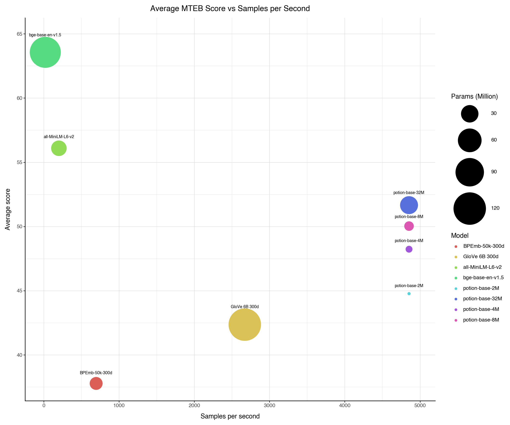

# Results

This document contains the results of the Model2Vec project. The results are presented in the following sections:
- [MTEB Results](#mteb-results)
- [Training Results](#training-results)
- [Ablations](#ablations)

## MTEB Results (English)

Model2Vec is evaluated on MTEB, as well as two additional tasks: [PEARL](https://github.com/tigerchen52/PEARL) (a phrase representation task) and WordSim (a collection of _word_ similarity tasks). The results are shown in the table below.

Note: The `potion` and `M2V` models are our static models.

| Model                  |   Avg (All) |   Avg (MTEB) |   Class |   Clust |   PairClass |   Rank |    Ret |    STS |    Sum |   Pearl |   WordSim |
|:-----------------------|------------:|-------------:|--------:|--------:|------------:|-------:|-------:|-------:|-------:|--------:|----------:|
| [all-MiniLM-L6-v2](https://huggingface.co/sentence-transformers/all-MiniLM-L6-v2)        | 56.08     | 56.09      | 62.62  | 41.94  | 82.37     | 58.04  | 41.95  | 78.90  | 30.81  | 60.83  | 49.91   |
| [potion-base-32M](https://huggingface.co/minishlab/potion-base-32M)                     | 52.46     | 51.66      | 65.97  | 35.29  | 78.17     | 50.92  | 33.52  | 74.22  | 29.78  | 55.37  | 55.15   |
| [potion-base-8M](https://huggingface.co/minishlab/potion-base-8M)                       | 50.54     | 50.03      | 64.44  | 32.93  | 76.62     | 49.73  | 31.71  | 73.24  | 29.28  | 53.54  | 50.75   |
| [potion-retrieval-32M](https://huggingface.co/minishlab/potion-retrieval-32M)           | 49.73     | 49.76      | 59.56  | 30.55  | 76.38     | 50.05  | 36.35  | 73.22  | 28.85  | 49.31  | 50.02   |
| [potion-base-4M](https://huggingface.co/minishlab/potion-base-4M)                       | 48.87     | 48.23      | 62.19  | 31.47  | 75.37     | 48.75  | 29.11  | 72.19  | 28.89  | 52.55  | 49.21   |
| [static-retrieval-mrl-en-v1](https://huggingface.co/minishlab/static-retrieval-mrl-en-v1) | 48.18     | 48.36      | 57.39  | 28.32  | 75.63     | 49.16  | 35.61  | 72.18  | 28.64  | 49.68  | 44.76   |
| [static-similarity-mrl-multilingual-v1](https://huggingface.co/minishlab/static-similarity-mrl-multilingual-v1) | 48.15     | 47.15      | 59.96  | 24.40  | 79.02     | 48.25  | 29.54  | 74.88  | 30.28  | 51.66  | 51.66   |
| [M2V_base_output](https://huggingface.co/minishlab/M2V_base_output)                     | 46.79     | 45.34      | 61.25  | 25.58  | 74.9      | 47.63  | 26.14  | 68.58  | 29.2   | 54.02  | 49.18   |
| [potion-base-2M](https://huggingface.co/minishlab/potion-base-2M)                       | 45.52     | 44.77      | 58.45  | 27.5   | 73.72     | 46.82  | 24.13  | 70.14  | 31.51  | 50.82  | 44.72   |
| [GloVe_300d](https://huggingface.co/sentence-transformers/average_word_embeddings_glove.6B.300d)             | 42.84     | 42.36      | 57.31  | 27.66  | 72.48     | 43.3   | 22.78  | 61.9   | 28.81  | 45.65  | 43.05   |
| [BPEmb_50k_300d](https://github.com/bheinzerling/bpemb)                                  | 39.34     | 37.78      | 55.76  | 23.35  | 57.86     | 43.21  | 17.5   | 55.1   | 29.74  | 47.56  | 41.28   |

  
  Task Abbreviations 

For readability, the MTEB task names are abbreviated as follows:
- Class: Classification
- Clust: Clustering
- PairClass: PairClassification
- Rank: Reranking
- Ret: Retrieval
- STS: Semantic Textual Similarity
- Sum: Summarization

The results show that [potion-base-32M](https://huggingface.co/minishlab/potion-base-32M) is the most performant static embedding model. It reaches 92.11% of the performance of [all-MiniLM-L6-v2](https://huggingface.co/sentence-transformers/all-MiniLM-L6-v2) with an average MTEB score of 51.66 while being orders of magnitude faster.

Note: the [potion-retrieval-32M](https://huggingface.co/minishlab/potion-retrieval-32M), [static-retrieval-mrl-en-v1](https://huggingface.co/minishlab/static-retrieval-mrl-en-v1), and [static-similarity-mrl-multilingual-v1](https://huggingface.co/minishlab/static-similarity-mrl-multilingual-v1) models are task-specific models. We've included them for completeness, but they should not be compared directly to the other models for tasks that they are not designed for.

The figure below shows the relationship between the number of sentences per second and the average MTEB score. The circle sizes correspond to the number of parameters in the models (larger = more parameters).
This plot shows that the potion and M2V models are much faster than the other models, while still being competitive in terms of performance with the [all-MiniLM-L6-v2](https://huggingface.co/sentence-transformers/all-MiniLM-L6-v2) model.
NOTE: for fairness of comparison, we disabled multiprocessing for Model2Vec for this benchmark. All sentence-transformers models are run with the [sentence-transformers](https://github.com/UKPLab/sentence-transformers) library's default settings for `encode`.

|  |
|:--:|
|*Figure: The average MTEB score plotted against sentences per second. The circle size indicates model size.*|

### MMTEB Results (Multilingual)
The results for the multilingual models are shown in the table below. We compare against the [LaBSE](https://huggingface.co/sentence-transformers/LaBSE) model, as well as other multilingual static embedding models.

| Model                                     | Mean (Task) | Mean (TaskType) | BitMining | Class | Clust | InstRet | MultiClass | PairClass | Rank | Ret | STS       |
| :---------------------------------------- | :---------- | :-------------- | :------------ | :------------- | :--------- | :-------------------- | :------------------------ | :------------------ | :-------- | :-------- | :-------- |
| [LaBSE](https://huggingface.co/sentence-transformers/LaBSE) |       52.07 |           45.65 |         76.35 |          54.60 |      38.08 |                 −3.00 |                     20.12 |               75.97 |     50.20 |     33.17 | 65.35 |
| [potion-multilingual-128M](https://huggingface.co/minishlab/potion-multilingual-128M)              | 47.31   | 40.40           | 40.72         | 52.36      | 38.80  | −2.08                 | 15.95                 | 71.39               | 47.39     | 37.86     | 61.23     |
| [static-similarity-mrl-multilingual-v1](https://huggingface.co/sentence-transformers/static-similarity-mrl-multilingual-v1) | 47.24       | 41.38       | 50.62     | 48.60          | 30.67      | −1.24                 | 14.74                     | 74.34           | 49.45 | 41.21 | 64.02 |
| [M2V_multilingual_output](https://huggingface.co/minishlab/M2V_multilingual_output)           | 42.13       | 35.89           | 36.88         | 49.75          | 30.09      | −0.07             | 14.34                     | 69.74               | 41.51     | 25.42     | 55.33     |

As can be seen, [potion-multilingual-128M](https://huggingface.co/minishlab/potion-multilingual-128M) is the most performant static multilingual model, reaching 90.86% of the performance of [LaBSE](https://huggingface.co/sentence-transformers/LaBSE). There are differences per task. The [static-similarity-mrl-multilingual-v1](https://huggingface.co/sentence-transformers/static-similarity-mrl-multilingual-v1) model is better for retrieval and STS tasks (which can be explained by the fact that it's trained for STS), while the [potion-multilingual-128M](https://huggingface.co/minishlab/potion-multilingual-128M) model is better for classification and clustering tasks. It is important to note that the [potion-multilingual-128M](https://huggingface.co/minishlab/potion-multilingual-128M) model supports a  total of 101 languages, while [static-similarity-mrl-multilingual-v1](https://huggingface.co/sentence-transformers/static-similarity-mrl-multilingual-v1) supports only 50 languages. It is also important to note that MMTEB does not include tasks for every language, and there may be a bias towards larger languages.

  
  Task Abbreviations 

For readability, the MMTEB task names are abbreviated as follows:

- BitMining: Bitext Mining
- Class: Classification
- Clust: Clustering
- InstRet: Instruction Retrieval
- MuliClass: Multilabel Classification
- PairClass: PairClassification
- Rank: Reranking
- Ret: Retrieval
- STS: Semantic Textual Similarity

### Retrieval Results

A subset of models we created and compare against are specifically designed for retrieval tasks. The results are shown in the table below, including two general-purpose models for comparison and a transformer.

| Model                  |   Retrieval Score |
|:-----------------------|------------------:|
| [all-MiniLM-L6-v2](https://huggingface.co/sentence-transformers/all-MiniLM-L6-v2)        | 41.95              |
| [potion-retrieval-32M](https://huggingface.co/minishlab/potion-retrieval-32M)           | 36.35              |
| [static-retrieval-mrl-en-v1](https://huggingface.co/minishlab/static-retrieval-mrl-en-v1) | 35.61     |
| [potion-base-32M](https://huggingface.co/minishlab/potion-base-32M)                     | 33.52              |
| [potion-base-8M](https://huggingface.co/minishlab/potion-base-8M)                       | 31.71              |

As can be seen, [potion-retrieval-32M](https://huggingface.co/minishlab/potion-retrieval-32M) model is the most performant static retrieval model, reaching 86.65%% of the performance of [all-MiniLM-L6-v2](https://huggingface.co/sentence-transformers/all-MiniLM-L6-v2) with a retrieval score of 36.35.

## Training Results

The main results for Model2Vec training are outlined in this section.

We compare five different architectures for our main results:
- `model2vec + logreg`: A model2vec model with a scikit-learn `LogisticRegressionCV` on top.
- `model2vec full finetune`: A model2vec classifier with the full model finetuned. This uses our `StaticModelForClassification`.
- `tfidf`: A TF-IDF model with a scikit-learn `LogisticRegressionCV` on top.
- `setfit`: A [SetFit](https://github.com/huggingface/setfit/tree/main) model trained using [all-minilm-l6-v2](sentence-transformers/all-MiniLM-L6-v2) as a base model.
- `bge-base + logreg`: A [BGE-base](https://huggingface.co/BAAI/bge-base-en-v1.5) encoder model with a scikit-learn `LogisticRegressionCV` on top.

We use 14 classification datasets, using 1000 examples from the train set, and the full test set. No parameters were tuned on any validation set. All datasets were taken from the [Setfit organization on Hugging Face](https://huggingface.co/datasets/SetFit).

| dataset                    |   tfidf |   model2vec + logreg |   model2vec full finetune |   setfit |   bge-base + logreg |
|:---------------------------|--------:|---------------------:|--------------------------:|---------:|--------------------:|
| 20_newgroups               |   50.71 |                56.24 |                     57.94 |    61.29 |               67.39 |
| ade                        |   71.46 |                79.20 |                     79.68 |    83.05 |               86.12 |
| ag_news                    |   81.68 |                86.70 |                     87.20 |    88.01 |               88.95 |
| amazon_counterfactual      |   85.18 |                90.96 |                     91.93 |    95.51 |               92.74 |
| bbc                        |   95.09 |                95.80 |                     97.21 |    96.60 |               97.50 |
| emotion                    |   59.28 |                65.57 |                     67.11 |    72.86 |               65.63 |
| enron_spam                 |   96.00 |                96.40 |                     96.85 |    97.45 |               97.30 |
| hatespeech_offensive       |   66.45 |                83.54 |                     85.61 |    87.69 |               84.92 |
| imdb                       |   80.44 |                85.34 |                     85.59 |    86.00 |               92.25 |
| massive_scenario           |   77.26 |                82.86 |                     84.42 |    83.54 |               87.07 |
| senteval_cr                |   65.61 |                77.03 |                     79.47 |    86.15 |               90.53 |
| sst5                       |   18.52 |                32.34 |                     37.95 |    42.31 |               38.49 |
| student                    |   74.16 |                83.20 |                     85.02 |    89.62 |               89.71 |
| subj                       |   86.39 |                89.20 |                     89.85 |    93.80 |               94.55 |
| tweet_sentiment_extraction |   53.20 |                64.96 |                     62.65 |    75.15 |               69.48 |

|         |   tfidf |   model2vec + logreg |   model2vec full finetune |   setfit |   bge-base + logreg |
|:--------|--------:|---------------------:|--------------------------:|---------:|--------------------:|
| average |    70.8 |                 78.0 |                      79.2 |     82.6 |                82.8 |

As can be seen see, full fine-tuning brings modest performance improvements in some cases, but very large ones in other cases, leading to a pretty large increase in average score. Our advice is to test both if you can use `potion-base-32m`, and to use full fine-tuning if you are starting from another base model.

The speed difference between model2vec and the other models is immeense, with the full finetune being 35x faster than a setfit based on `all-minilm-l6-v2` on CPU and 200x faster than the`bge-base` transformer model.

|                  |   tfidf |   model2vec + logreg |   model2vec full finetune |   setfit |   bge-base + logreg |
|:-----------------|--------:|---------------------:|--------------------------:|---------:|--------------------:|
| samples / second |  108434 |                17925 |                     24744 |      716 |                 118 |

The figure below shows the relationship between the number of sentences per second and the average training score, where we've included more transformer-based models for comparison.

|  |
|:--:|
|*Figure: The average training score plotted against sentences per second (log scale).*|

## Ablations

To better understand the factors contributing to the performance of Model2Vec, we conducted a comprehensive set of ablation studies, covering various aspects of the model's architecture and preprocessing methods. In these studies, we examined the impact of key elements such as PCA, Zipf weighting, and the use of Sentence Transformers versus regular transformer models. We also compared the performance of input embeddings versus output embeddings, since it would seem plausible that these should also work well. The results are shown in the table below.

| Model                        |   Avg (All) |   Avg (MTEB) |   Class |   Clust |   PairClass |   Rank |   Ret |   STS |   Sum |   Pearl |   WordSim |
|:-----------------------------|------------:|-------------:|--------:|--------:|------------:|-------:|------:|------:|------:|--------:|----------:|
| M2V_base_output              |       46.79 |        45.34 |   61.25 |   25.58 |       74.9  |  47.63 | 26.14 | 68.58 | 29.2  |   54.02 |     49.18 |
| M2V_base_output_nopca        |       44.04 |        42.31 |   61.42 |   20.15 |       68.21 |  44.67 | 25.25 | 61.87 | 29.85 |   51.02 |     48.96 |
| M2V_base_output_nozipf       |       43.61 |        41.52 |   60.44 |   21.62 |       72.15 |  45.57 | 20.35 | 62.71 | 30.66 |   52.28 |     49.17 |
| M2V_base_input_nozipf_nopca  |       40.97 |        39.55 |   54.16 |   18.62 |       68.3  |  43.65 | 23.63 | 59.38 | 32.04 |   50.19 |     40.52 |
| M2V_base_output_nozipf_nopca |       40.8  |        38.44 |   59.78 |   19.31 |       62.39 |  42.26 | 19.01 | 55.16 | 30    |   49.09 |     48.97 |
| M2V_base_input               |       40.74 |        39.93 |   60.35 |   22.66 |       59.63 |  43.02 | 25.47 | 50.05 | 29.35 |   50.61 |     34.47 |
| M2V_bert_output_nozipf_nopca              |       35.54 |        34.82 |   55.69 |   15.42 |       58.68 |  39.87 | 12.92 | 55.24 | 30.15 |   46.9  |     26.72 |

There's four main findings in these results:
1. Non-Sentence Transformers do not work well. This can be seen by comparing `M2V_bert_output_nozipf_nopca` (which uses [BERT](https://huggingface.co/google-bert/bert-base-uncased), a non-Sentence Transformer) and `M2V_base_output_nozipf_nopca` (which uses [BGE-base](https://huggingface.co/BAAI/bge-base-en-v1.5), a Sentence Transformer). Using a Sentence Transformer gives a ~5.2% increase in performance.
2. PCA is crucial for performance. This can be seen by comparing `M2V_base_output_nozipf_nopca` and `M2V_base_output_nozipf` which gives a ~2.8% increase in performance. Furthermore, PCA improves performance on _all_ tasks.
3. Zipf weighting is crucial for performance. This can be seen by comparing `M2V_base_output_nozipf_nopca` and `M2V_base_output_nopca` which gives a ~3.1% increase in performance.
4. Output embeddings outperform input embeddings. This can be seen by comparing `M2V_base_input` and `M2V_base_output` which gives a ~6.1% increase in performance. Note that input embeddings do work well for some tasks. We hypothesize that this is because input embeddings are inherently normalized.
