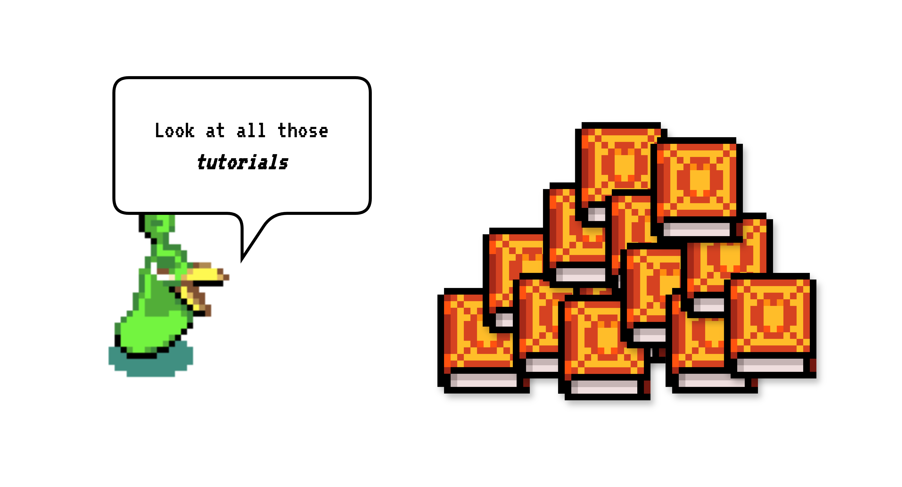

    <picture>
      
    </picture>
  </a>

# Tutorials

This is a list of all our tutorials. They are all self-contained ipython notebooks.

|                    | what?                                                                                                                                                                      | Link |
|--------------------|----------------------------------------------------------------------------------------------------------------------------------------------------------------------------|------|
| **Recipe search** | Learn how to do lightning-fast semantic search by distilling a small model. Compare a really tiny model to a larger with one with a better vocabulary. Learn what Fattoush is (delicious). |      |
